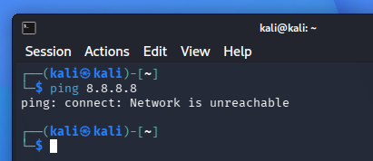
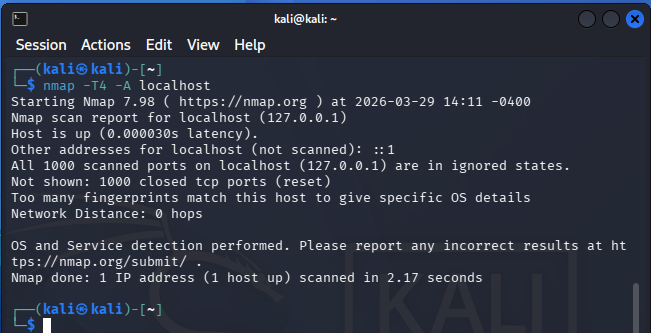
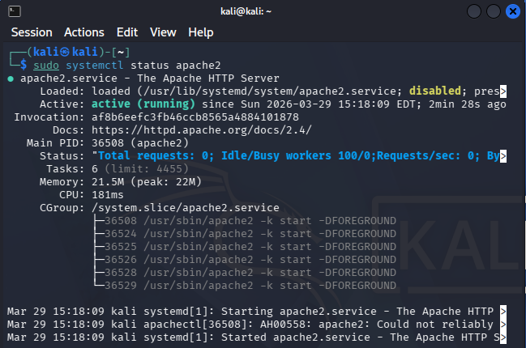
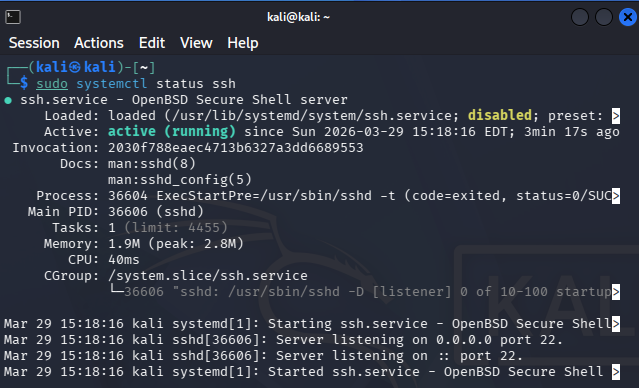
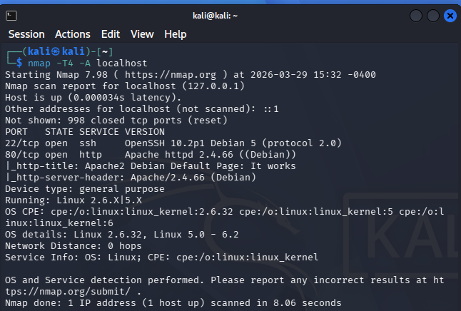

# h1 Kybertappoketju

Viikon läksyjen tarkemmat tehtävänannot voi lukea [täältä](https://terokarvinen.com/tunkeutumistestaus/#h1-kybertappoketju).

## x) Lue/katso/kuuntele ja tiivistä

### x-1) Herrasmieshakkerit - Tietoturvan Niksipirkka, vieraana Juho Rikala 0x34

Ensimmäisenä tuli kuunnella joko Herrasmieshakkereiden tai Darknet Diariesin podcastjakso, ja tiivistää se muutamiin ranskalaisiin viivoihin. Valitsin Herrasmieshakkereiden jakson [Tietoturvan Niksipirkasta](https://herrasmieshakkerit.fi/tietoturvan-niksipirkka-vieraana-juho-rikala-0x34/).

- Herrasmieshakkerit pitävät positiivisena uutisena sitä, että pohjoismainen linja tietosuojan seuraamusmaksuista on laajenemassa myös Suomeen. Säännöt pitäisi olla samat kaikille.
  - Aikaisemmin hallinnollisia seuraamusmaksuja ei ole voitu määrätä julkishallinnon toimijoille.
  - Muissa pohjoismaissa tietosuojaviranomainen on voinut määrätä maksuja myös julkiselle sektorille.
    - Laajempaa mallia on pidetty toimivana käytäntönä.
- K-plussaa käytti Q1/2024 aikana 3.4 miljoonaa suomalaista. Siinä on Keskon tietoturvajohtajalla muutama henkilötieto suojattavana.
  - Keskolla itsessään yli 40 brändiä, kolme liiketoiminta-alaa, noin 1800 kauppaa kahdeksassa maassa.
  - 2 miljoonaa asiakasta päivittäin.
  - Päivittäinen agenda pohtia, mitä kautta meitä vastaan voidaan hyökätä.
  - Miten näin laajaa laivaa hallitaan?
    - Keskitetty tietoturvatiimi, kehitys muiden IT-tiimien kanssa.
      - Riskilähtöinen kehitys, kvartaalittainen riskisuunnitelma.
  - Plussapalvelu kerää tietoa vain heiltä, jotka ovat antaneet siihen luvan.
    - Dataa kertyy mittavia määriä päivittäin.
    - Tiedot ovat hajautetusti eri paikoissa siten, missä milläkin tiedolla on merkitystä.

### x-2) Hutchins et al 2011: Ritirimpsu, ch3.2 Intrusion Kill Chain

Toisena tuli lukea [Hutchins et al 2011: Intelligence-Driven Computer Network Defense Informed by Analysis of Adversary Campaigns and Intrusion Kill Chains](https://lockheedmartin.com/content/dam/lockheed-martin/rms/documents/cyber/LM-White-Paper-Intel-Driven-Defense.pdf) -dokumentin kappale 3.2 Intrusion Kill Chain, ja tiivistää tämä muutamiin ranskalaisiin viivoihin.

- Intrusion Kill Chain kuvaa kyberhyökkäyksen vaiheittaisen etenemisen alusta loppuun.
- Malli perustuu sotilaalliseen F2T2EA-prosessiin (Find, Fix, Track, Target, Engage, Assess), mutta on sovellettu tietoverkkoihin.
- Vaiheet ovat:
  - Reconnaissance - Kohteiden tiedustelu ja tiedon keruu.
  - Weaponization - Haittakoodin ja haavoittuvuuden yhdistäminen hyökkäysvälineeksi.
  - Delivery - Haitallisen lähteen toimittaminen (esim. sähköposti, verkkosivut, USB).
  - Exploitation - Haavoittuvuuden hyödyntäminen ja koodin suoritus.
  - Installation - Pysyvän pääsyn (esim. troijalainen/backdoor) asentaminen.
  - Command & Control (C2) - Yhteyden muodostaminen hyökkääjän palvelimeen.
  - Actions of Objectives - Varsinaisten tavoitteiden toteutus (esim. datan varastaminen tai järjestelmän häirintä).
- Prosessi on ketju: yhden vaiheen epäonnistuminen estää koko hyökkäyksen etenemisen.

### x-3) Santos et al: The Art of Hacking

Kolmantena tuli katsoa viisi videota, jotka kattavat [Santos et al: The Art of Hacking](https://www.oreilly.com/videos/the-art-of/9780135767849/9780135767849-SPTT_04_00/) neljännen kappaleen aktiivisesta tiedustelusta.

#### 4.1 - Understanding Active Reconnaissance
- Passiivinen tiedustelu on huomaamatonta eikä jätä jälkiä.
- Aktiivinen tiedustelu sisältää skannauksia ja näkyy järjestelmissä.
- Aktiivisessa vaiheessa kerätään ja varmistetaan tietoa kohteesta.
- Toiminta muuttuu vähitellen aggressiivisemmaksi.
- Puutteellinen valvonta voi estää hyökkäysten havaitsemisen.

#### 4.2 - Exploring Active Reconnaissance Methodologies from an Ethical Hacker Perspective
- Selkeä metodologia on tärkeä tehokkaaseen tiedusteluun.
- Recon-vaihe auttaa tunnistamaan ja priorisoimaan kohteet.
- Aktiivinen tiedustelu etenee vaiheittain: porttiskannaus → web-palvelut → haavoittuvuusskannaus.
- Porttiskannaus vahvistaa ja löytää avoimia portteja.
- Haavoittuvuusskannaus tehdään vasta lopuksi.
- Skannaukset ovat havaittavia ja voivat laukaista hälytyksiä.

#### 4.3 - Surveying Essential Tools for Active Reconnaissance: Port Scanning and Web Service Review
- Aktiivisen tiedustelun keskeiset työkalut: Nmap, Masscan ja EyeWitness.
- Nmap on monipuolinen: portti-, palvelu- ja käyttöjärjestelmätunnistus sekä säädettävät skannausoptiot.
- Masscan on erittäin nopea ja soveltuu suuriin verkkoihin, mutta vähemmän monipuolinen.
- UDP-skannaus voi paljastaa lisäpalveluita (esim. DNS, NTP).
- EyeWitness auttaa priorisoimaan web-kohteet automaattisesti kuvakaappausten avulla.
- Tyypillinen työnkulku: skannaus → palveluiden tunnistus → kohteiden priorisointi.
- Skannaukset ovat tehokkaita mutta helposti havaittavia.

#### 4.4 - Surveying Essential Tools for Active Reconnaissance: Network and Web Vulnerability Scanners
- Haavoittuvuusskannaus jakautuu verkko- ja web-sovellustason skannaukseen.
- OpenVAS on ilmainen vaihtoehto, kun taas Nessus, Nexpose ja Qualys ovat kaupallisia ratkaisuja.
- Nmap tukee rajattua haavoittuvuusskannausta NSE-skriptien avulla.
- Web-haavoittuvuuksiin käytetään työkaluja kuten Nikto, WPScan, SQLmap.
- Burp Suite ja OWASP ZAP ovat monipuolisia proxy- ja testausratkaisuja.
- Nmapilla voidaan nopeasti tunnistaa kriittisiä haavoittuvuuksia koko verkosta (esim. SMB).
- Skannaukset voidaan kohdistaa yksittäisiin koneisiin tai koko verkkoon.

### x-4) KKO 2003:36
- A teki porttiskannauksen pankkikonsernin verkkoon tarkoituksenaan löytää tietoturva-aukkoja.
- Käräjäoikeus: syyte tietomurron yrityksestä hylättiin näytön epävarmuuden vuoksi.
- Hovioikeus: katsoi A:n syyllistyneen tietomurron yritykseen → sakot ja vahingonkorvaukset.
- Korkein oikeus: vahvisti, että porttiskannaus + tunkeutumistarkoitus = tietomurron yritys.
- Vahingonkorvaukset: A velvoitettiin maksamaan täysimääräisesti; ei sovittelua iästä huolimatta.

## a) Kalin asennus

Ensimmäinen Kalin asennus ei onnistunut ja syy jäi selvittämättä. Käytin asennuksessa apuna Karvisen [Debianin asennusohjetta](https://terokarvinen.com/2021/install-debian-on-virtualbox/) apuna. Latasin Kalin sivuilta uusimman ISO-tiedoston ja annoin asennuksen mennä oletusasetuksin läpi. Asennuksen jälkeen virtuaalikone ei kuitenkaan bootannut. Yksityiskohtaisempaa raporttia ei tästä asennuksesta tai syyn selvittämisestä ole.

Toisella yrittämällä latasin ja asensin Kalin Pre-built virtuaalikoneen Kalin sivuilta. Asennuksessa ei esiintynyt ongelmia. Muokkasin asennuksen jälkeen virtuaalikoneen RAM-muistin 4 GB.

### Käytetty työympäristö
Asennus suoritettiin kannettavalla tietokoneella, Lenovo Yoga Slim 7 Pro:lla (AMD Ryzen 7 5800H @ 3.20 GHz, 16 GB DDR4-3200, NVIDIA GeForce RTX 3050 laptop 4 GB GDDR6). Kannettavan käyttöjärjestelmä oli WIN11, versio 25H2.

Linuxin asentamiseen käytin Oraclen VM Virtual Box v7.2.6.

## b) Irrota Kali-virtuaalikone verkosta

Irroitin Internetin Kalin ylävalikon oikeasta laidasta painamalla verkko-kuvaketta ja valitsemalla ``Disconnect``. Ruudulle ilmestyi teksti Disconnected - The network connection has been disconnected. 

Varmistin vielä, että internet-yhteys on tosiaan katkaistu pingaamalla googlen IP-osoitetta 8.8.8.8.
Vastauksena komentokehoite antoi: ``ping: connect: Network is unreachable``. Verkko on siis pois päältä.

## c) 1000 TCP-porttia localhostista

Tehtävässä ajoin komentokehotteessa komennon ``$ nmap -T4 -A localhost``. Komennossa tapahtuu seuraavaa:

- nmap - Käynnistää työkalun verkon kartoitukseen.
- -T4 -flag - Ajoitusmalli (Timing template).
  - Nopeuttaa skaalausta, skaalahaitari T0 (erittäin hidas) - T5 (erittäin nopea (myös epävakaampi)).
  - Lisää nmapin [dokumentaatiosta](https://nmap.org/book/performance-timing-templates.html).
- -A -flag - Aggressiivinen skannaus.
  - Sisältää useita toimintoja:
    - OS detection - Käyttöjärjestelmän tunnistus.
    - Version detection - palveluiden versioiden tunnistus.
    - Script scanning (NSE) - lisäanalyysi (esim. haavoittuvuuksia).
    - Traceroute - reitti kohteeseen.
  - Lisää nmapin [dokumentaatiosta](https://nmap.org/book/man-misc-options.html).
- localhost - Oma kone

Kuvan tuloksista voidaan päätellä seuraavaa:

- Nmap käynnistettiin versiolla 7.98 kuvan mukaiseen aikaan.
- Nmapin kohteena oli localhost (IP 127.0.0.1), eli oma koneeni.
- Kohde on saavutettavissa.
- Localhostille löytyi myös IPv6-osoite (::1), mitä ei kuitenkaan skannattu.
- ``All 1000 scanned ports ... are in ignored states.`` - Kaikki skannatut portit ovat kiinni.
- ``Too many fingerprints ... specific OS details`` - Ei onnistu tunnistamaan käyttöjärjestelmää.
- ``Network Distance: 0 hops`` - Skannasin itseni, ei ylimääräisiä reitittimiä tm. välietappeja matkalla.

## d) Kaksi demonia

Tehtävän demoneiksi valitsin Apache2:n ja openssh serverin. Asensin demonit syöttämällä komentokehotteeseen asennuskomennot:

- ``$ sudo apt-get install -y apache2``
- ``$ sudo apt-get install -y openssh-server``

Asennusten mentyä läpi onnistuneesti, käynnistin molemmat demonit:

- ``$ sudo systemctl start apache2``
- ``$ sudo systemctl start ssh``

Tämän jälkeen tarkistin, että molemmat demonit ovat käynnissä komennoilla:

- ``$ sudo systemctl status apache2``
- ``$ sudo systemctl status ssh``

Sitten vielä kerran ``$ nmap -T4 -A localhost``

Aiemmasta testistä poiketen, tällä kertaa tuloksista paljastuu myös seuraavaa:

- ``22/tcp open  ssh     OpenSSH 10.2p1 Debian 5 (protocol 2.0)``
  - Portti 22/tcp on auki
  - Palvelu on SSH-palvelin
  - Versio OpenSSH 10.2p1
- ``80/tcp open  http    Apache httpd 2.4.66 ((Debian))``
  - Portti 80/tcp on auki
  - Palvelu on weppipalvelin
  - Versio Apache httpd 2.4.66
- ``Running: Linux...``
  - Käyttöjärjestelmänä on Linux

## Lähteet

Tero Karvinen

Nmap
- https://nmap.org/book/performance-timing-templates.html
- https://nmap.org/book/man-misc-options.html
