# h2 DORA the Explora

Viikon läksyjen tarkemmat tehtävänannot luettavissa [täältä](https://terokarvinen.com/tunkeutumistestaus/#h2-dora-the-explora).

## x) Tiivistelmiä

:warning:Kannattaa muistaa tallentaa, jos vaikka sattuis tilttaamaan. -nimim. Tilttasprkl:warning:

### x-1) Marko Buuri, DORA and TLPT testing - Lecture for Haaga-Helia on 31 March 2026

- DORA(Digital Operation Resilience Act) on EU:n sääntö, jonka tarkoitus on varmistaa, että finanssialan yritykset kestävät kyberhäiriöitä.
- DORA koskee suurta määrää toimijoita (yli 20 000) sekä niiden IT-kumppaneita.
- DORA vaatii yrityksiltä kahta testaustyyppiä:
  - Peruskyberturvatestausta kaikille.
  - Kehittyneempää hyökkäyssimulaatiota (TLPT) vain tärkeimmille toimijoille.
- TLPT-testit (Threat-Led Penetration Testing) simuloivat oikeita kyberhyökkäyksiä, jotta nähdään miten hyvin yritys puolustautuu.
- TIBER-EU on Euroopan keskuspankin kehittämä malli, joka ohjaa näiden hyökkäyssimulaatioiden toteutusta.
- Suomessa käytetään TIBER-FI-mallia, joka on sovitettu DORA-vaatimuksiin.
- Testausprojektiin osallistuu useita rooleja, kuten:
  - Uhkia tiedusteleva ja hyökkäysskenaarioita suunnitteleva Threat Intelligence.
  - Hyökkääjiä simuloiva Red Team.
  - Puolustava Blue Team.
  - Projektia ohjaava Control Team.
- Testausprosessi etenee kolmessa päävaiheessa:
  - Valmistelu
  - Testaus (uhkatiedustelu + hyökkäys)
  - Lopetus ja raportointi
- Koko testiprojekti kestää yleensä noin 12–18 kuukautta.
- Testauksen tarkoitus ei ole “murtaa järjestelmää”, vaan oppia, miten suojaukset toimivat ja miten niitä voidaan parantaa.

Marko Buurin esityksen kaikki diat luettavissa [täältä](https://terokarvinen.com/buuri-2026-dora-and-threat-lead-penetration-testing/buuri-2026-dora-and-threat-lead-penetration-testing--teros-pentest-course.pdf).

### x-2) DORA artiklat 26 ja 27

#### TLPT-testauksesta (art. 26)
- Suurempien rahoitusalan toimijoiden on tehtävä kyberhyökkäyksiä simuloiva testaus vähintään 3 vuoden välein
- Testaus kohdistuu kriittisiin toimintoihin ja oikeisiin järjestelmiin, myös ulkoistettuihin
- Yritys vastaa testauksesta, vaikka mukana olisi ulkoisia palveluntarjoajia
- Tarvittaessa voidaan tehdä yhteistestaus usean yrityksen kesken
- Testauksen aikana on suojattava tiedot ja estettävä häiriöt
- Lopuksi:
  - Tehdään raportti ja korjaussuunnitelma
  - Viranomainen antaa hyväksynnän
- Viranomaiset päättävät, ketkä yritykset testataan riskien perusteella

#### Testaajista (art. 27)
- Testaajien pitää olla:
  - Päteviä, luotettavia, sertifioituja (tai riittävä pätevyys, kokemus ja ) ja vakuutettuja.
- Ulkoisia testaajia käytetään pääsääntöisesti.
  - Vaatimuksena vähintään joka kolmannessa testissä.
- Sisäiset testaajat sallitaan vain tietyin ehdoin:
  - Viranomaisen hyväksyntä.
  - Riittävät resurssit.
  - Ei eturistiriitoja (riippumattomuus testattavista toiminnoista).
  - Uhkatiedustelu (threat intelligence) tulee olla ulkopuoliselta toimijalta.
- Kaikki testauksen data on käsiteltävä turvallisesti ilman lisäriskejä.

Lisää DORA:n artikloista voi lukea [täältä](https://eur-lex.europa.eu/eli/reg/2022/2554/oj/eng#art_26).

### x-3) TIBER-FI - 5.4 Red Team Testing
- Testisuunnitelman hyväksymisen jälkeen alkaa Red Team -testaus, jossa simuloidaan oikeita kyberhyökkäyksiä valittuihin kriittisiin toimintoihin.
- Testaus etenee kahdessa vaiheessa:
  - Testisuunnitelman laatiminen (RTTP, Red Team Test Plan).
  - Varsinainen aktiivinen testaus.
- Hyökkäys etenee tyypillisesti vaiheittain:
  - Tiedon keruu -> valmistelu -> hyökkäyksen käynnistys -> murtautuminen -> liikkuminen järjestelmissä -> tavoitteiden saavuttaminen.
- Testin tarkoitus on jäljitellä todellisia hyökkääjiä mahdollisimman realistisesti.
  - Rajoitteet, kuten aika, resurssit ja eri säännöt vaikuttavat testien realistisuuteen.
- Yritys voi antaa testaajille lisätietoa (grey box-testaus), mikä yleensä parantaa testin hyötyä.
  - Esim. rajallisessa ajassa saadaan kohdennetumpaa ja tehokkaampaa testausta.
- Jos testaus ei etene (esim. ajan tai suojauksen takia), testaajille voidaan antaa lisäapua (Leg-Up), jotta testin tavoitteet saavutetaan.
- Testin aikana myös uhkatiedustelua voidaan päivittää jatkuvasti, jotta testaus olisi tehokkaampaa.

Lisää TIBER-FI-ohjeistuksesta voi lukea [täältä](https://www.suomenpankki.fi/globalassets/bof/en/money-and-payments/the-bank-of-finland-as-catalyst-payments-council/tiber-fi/tiber-fi-2.0-procedures-and-guidelines.pdf).

### x-4) Marko Buuri - Releasing Your Inner TIBER in Regulated Adversary Simulations

Vapaaehtoinen tehtävä, tällä kertaa tallennettu soittolistaan.

Video katsottavissa [täältä](https://www.youtube.com/watch?v=z6KIEEknKjM).

## a) Asenna Metasploitable 2

Metasploitable 2 asennettu tunnilla. Asennuksessa ei tullut vastaan ongelmia.

Asennus lyhykäisyydessään:
- Latasin asennukseen tarvittavan Zip-kansion rapid7.com
  - Puretusta kansiosta löytyy mm. ``Metasploitable.vmdk``-tiedosto.
- Asensin uuden virtuaalokoneen VirtualBoxiin
  - Kone nimetty Metasploitable
  - Tyyppi Linux, OS Other Linux (64-bit)
  - 2048MB RAM
  - Specify virtual hard disk -> Use an Existing Virtual Hard Disk File:
    - Valitsin aiemmin mainitun ``Metasploitable.vmdk``-tiedoston.
- Valmis

Asennuksen jälkeen tarkistettu, että kone käy ja kukkuu.

## b) Virtuaaliverkko Kalin ja Metasploitablen välille

Kahden virtuaalikoneen (Kali ja Metasploitable) välinen virtuaaliverkko asennettu tunnilla.

Host-only-verkkoa luodessa ilmeni ``Could not find Host Interface Networking driver! Please reinstall.`` -virheilmoitus. Löysin verrattain vanhan [keskustelun](https://stackoverflow.com/questions/37934711/virtual-box-host-only-network-interface), jonka avulla asensin tarvittavan ajurin uudelleen polusta ``C:\Program Files\Oracle\VirtualBox\drivers\network\netadp6\VBoxNetAdp6.inf``. Tämän jälkeen Host-only-verkon luominen onnistui.

Host-only-verkon konfigurointiin löytyi googlettamalla selkeä [ohje](https://medium.com/cyber-collective/setting-up-metasploitable-in-virtualbox-on-kali-linux-1d5c3212f7f3). Lyhykäisyydessään Host-only-verkon luominen tapahtui:
- Valitse Network -> Create.
- Valitse luodun verkon kohdalla Properties.
- Adapter -> Configure Adapter Manually.
- DHCP Server -> Enable.
- Tallenna muutokset Applysta.

Lopputuloksena on uusi Host-only Network, jonka nimi on ``VirtualBox Host-Only Ethernet Adapter #nro``.

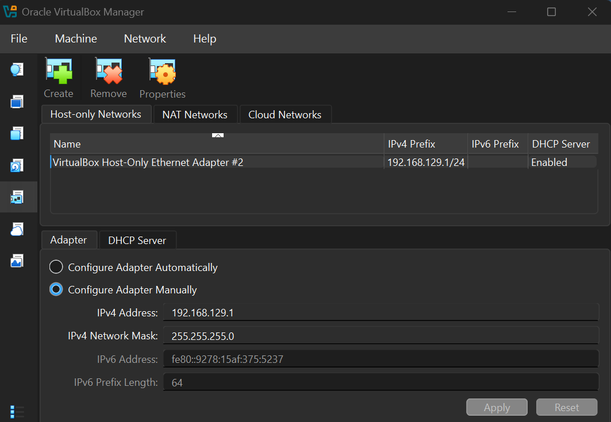

Seuraavaksi uusi verkko tuli lisätä kumpaankin virtuaalikoneeseen:
- Valitse virtuaalikone -> Settings.
- Valitse Network ja:
  - Kalissa Adapter 2 -> Enable -> Attached to: Host-only Adapter.
  - Metasploitablessa Adapter 1 -> Enable ja Attached to: Host-only Adapter.
- Hyväksy muutokset painamalla OK.

Nyt Kalista löytyy kaksi verkkokorttia, NAT ja Host-only, ja Metasploitablesta pelkästään Host-only.

Kali:

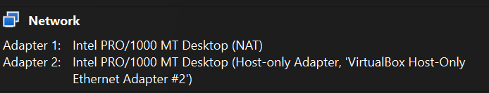

Metasploitable:

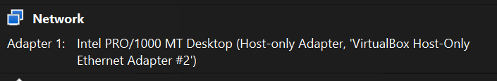

## c) Vain omassa verkossa

Ensimmäiseksi poistin Kalin julkisesta verkosta kytkemällä ensimmäisen verkon pois päältä Kalin oikean yläkulman verkkoasetuksista. Aktiivisista verkoista jäljelle jäi Wired connection 2, joka on aiemmin luotu Host-only -verkko.

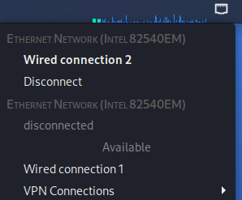

Tämän jälkeen tarkistin vielä komennoilla ``$ ip a`` ja ``$ ping 8.8.8.8``, että koneet olivat varmasti irti julkisesta verkosta. ``$ ip a``-komennolla sain myös samalla selvitettyä, mikä kyseisen virtuaalikoneen IP-osoite on.

Kali:

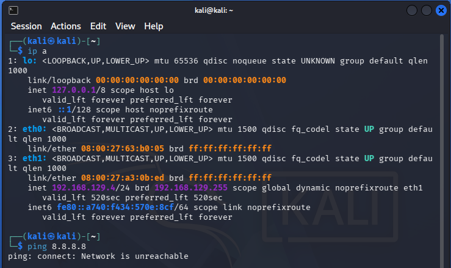

``$ ip a``-komennon halutut vastaukset:
- eth0 - verkkokortti on olemassa, mutta ei ole käytössä.
- eth1 - Aktiivinen verkkoliitäntä
  - IP: 192.168.129.4
- ``$ ping 8.8.8.8`` - connect: Network is unreachable.
  - Kone ei ole yhteydessä ulkomaailmaan.
 
Metasploitable:

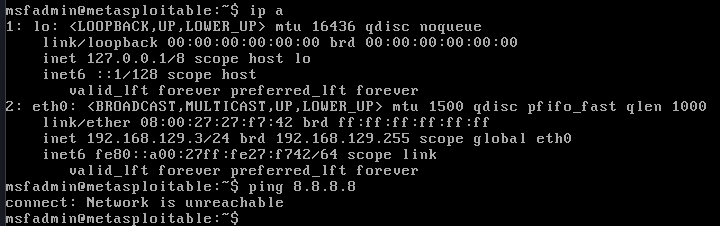

``$ ip a``-komennon halutut vastaukset:
- eth0 - Aktiivinen verkkoliitäntä
  - IP: 192.168.129.3
- ``$ ping 8.8.8.8`` - connect: Network is unreachable.
  - Kone ei ole yhteydessä ulkomaailmaan.

Seuraavana tuli osoittaa, että koneet saavat yhteyden toisiinsa. Edellisessä osiossa selvitin kummankin tietokoneen IP-osoitteen, niin tässä kohdin tuli enää pingata Kalista Metasploitableen ja päin vastoin, eli:

- Kali -> Metasploitable: Kalin komentoriviin ``$ ping 192.168.129.3``.
- Vastauksena kohde 192.168.129.3 vastasi pingiin normaalisti.

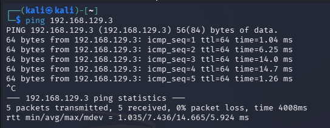

- Sekä Metasploitable -> Kali: Metasploitablen komentoriviin ``$ ping 192.168.129.4``.
- Vastauksena kohde 192.168.129.4 vastasi myös pingiin normaalisti.

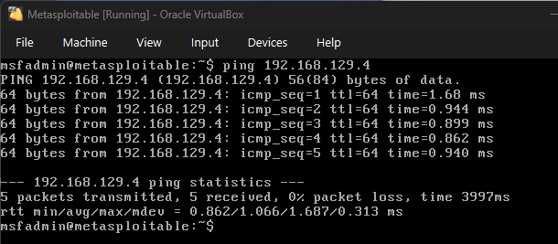

Tietokoneet ovat näin ollen ulkona muusta maailmasta, mutta saavat yhteyden toisiinsa.

## d) Etsi Metasploitable

Tehtävän aluksi skannasin Metasploitablen IP-osoitteen komennolla ``$ nmap -sn 192.168.129.3``. Nmapin [-sn](https://nmap.org/book/man-host-discovery.html) tarkistaa vain aktiiviset laitteet ilman porttiskannausta. Vastauksena sain seuraavaa:

> Starting Nmap 7.98 ( https://nmap.org ) at 2026-04-05 19:33 -0400  
> mass_dns: warning: Unable to determine any DNS servers. Reverse DNS is disabled.  
> Nmap scan report for 192.168.129.3  
> Host is up (0.00099s latency).  
> MAC Address: 08:00:27:27:F7:42 (Oracle VirtualBox virtual NIC)  
> Nmap done: 1 IP address (1 host up) scanned in 0.10 seconds

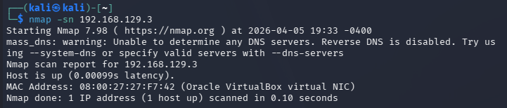

Tästä saadaan selville mm:
- 192.168.129.3 - Löytyy laite
- Host is up - Vastaa siis verkossa
- Oracle VirtualBox virtual NIC - Virtuaalikone

Tehtävänannossa mainittu *"Tarkista selaimella, että löysit oikean IP:n"* hieman kummitteli tässä kohti, sillä tekstistä voisi ymmärtää, että IP-osoitteita olisi useampi. Itse olin kartoittanut verkon suoraan Metasploitableen, joten osoitteita oli vain yksi mistä valita. Hankalaa siis ampua ohi.  Uusi yritys hieman laajemmalla haulla.

Aikaisemmin IP-osoitteita selvittäessä kävi ilmi, että aliverkon peite oli /24 (255.255.255.0). Tämä tarkoitti, että verkkoalue on 192.168.129.0/24. Kartoitin tällä kertaa koko verkkoalueen komennolla ``$ nmap -sn 192.168.129.0/24``. Nyt vastaus oli myös kattavampi:
> Starting Nmap 7.98 ( https://nmap.org ) at 2026-04-05 19:44 -0400  
> mass_dns: warning: Unable to determine any DNS servers. Reverse DNS is disabled. Try using --system-dns or specify valid servers with --dns-servers  
> Nmap scan report for 192.168.129.1  
> Host is up (0.00046s latency).  
> MAC Address: 0A:00:27:00:00:16 (Unknown)  
> Nmap scan report for 192.168.129.2  
> Host is up (0.00033s latency).  
> MAC Address: 08:00:27:03:62:85 (Oracle VirtualBox virtual NIC)  
> Nmap scan report for 192.168.129.3  
> Host is up (0.0089s latency).  
> MAC Address: 08:00:27:27:F7:42 (Oracle VirtualBox virtual NIC)  
> Nmap scan report for 192.168.129.4  
> Host is up.  
> Nmap done: 256 IP addresses (4 hosts up) scanned in 2.05 seconds

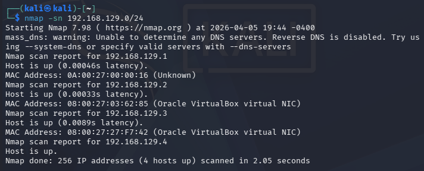

Nyt skannauksessa löytyi neljä aktiivista laitetta. Kaksi näistä on MAC-osoitteiden perusteella virtuaalikoneita, ja toinen näistä käyttämäni Kali, niin vastaukseksi jäi jäljelle laite, jonka IP-osoite on 192.168.129.3.

Suuntasin seuraavaksi selaimella osoitteeseen 192.168.129.3, josta avautui Metasploitablen sivu.

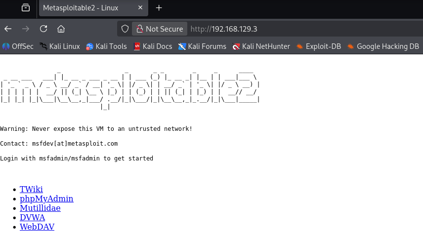

## e) Porttiskannaa Metasploitable

Ajoin tehtävässä komennon ``$ nmap -A -T4 -p- 192.168.129.3``, mistä sain pitkän vastauksen auki olevia portteja. Tehtävässä tuli poimia 2-3 hyökkääjälle kiinnostavinta porttia. Löysin [artikkelin](https://medium.com/@saksheebapat_47568/port-essentials-a-quick-guide-for-future-soc-analysts-1eaa92892034), missä esitetään yleisiä portteja ja niihin liittyviä tietoturvariskejä. Valitsin kuitenkin itselleni kaksi entuudestaan hieman tunnettua porttia: 21 (FTP) ja 23 (Telnet).

Portti 21 (FTP):
> 21/tcp    open  ftp         vsftpd 2.3.4  
> | ftp-syst:  
> |   STAT:  
> | FTP server status:  
> |      Connected to 192.168.129.4  
> |      Logged in as ftp  
> |      TYPE: ASCII  
> |      No session bandwidth limit  
> |      Session timeout in seconds is 300  
> |      Control connection is plain text  
> |      Data connections will be plain text  
> |      vsFTPd 2.3.4 - secure, fast, stable  
> | _End of status  
> | _ftp-anon: Anonymous FTP login allowed (FTP code 230)

Artikkelin mukaan FTP on riskialtis protokolla, koska se ei käytä salausta. Hyökkääjä voi siepata verkossa kulkevaa liikennettä (sniffing) ja saada selville käyttäjätunnuksia ja salasanoja. Lisäksi palveluun voidaan kohdistaa brute force -hyökkäyksiä. Porttiskannauksen perusteella Metasploitablen FTP-portti on avoinna ja sallii anonyymin kirjautumisen. Hyökkääjä pääsee näin ollen palveluun ilman tunnuksia.

Portti 23 (Telnet):
> 23/tcp    open  telnet      Linux telnetd

Artikkelin mukaan Telnetiä käytetään etäkirjautumiseen, mutta sen liikenne ei ole salattua. Kaikki informaatio, käyttäjätunnukset ja salasanat mukaan lukien kulkevat selvästi verkossa. Telnet onkin altis salakuuntelulle (eavesdropping), jolloin hyökkääjä voi siepata kirjautumistiedot. Porttiskannaus näyttää Telnet-portin olevan auki, joten tunnukset saatuaan hyökkääjällä on etäyhteys järjestelmään.

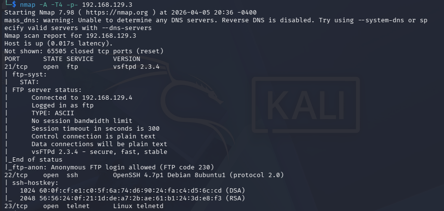

## f) Murtaudutaan Metasploitableen

Vapaaehtoinen, toistaiseksi skippiä ja paremmalla ajalla uusiksi.

## g) Metasploit-hyökkäysohjelma

Vapaaehtoinen, toistaiseksi skippiä ja paremmalla ajalla uusiksi.

## Lähteet

Tero Karvinen
- https://terokarvinen.com/tunkeutumistestaus/#h2-dora-the-explora

Marko Buuri
- https://terokarvinen.com/buuri-2026-dora-and-threat-lead-penetration-testing/buuri-2026-dora-and-threat-lead-penetration-testing--teros-pentest-course.pdf
- https://www.youtube.com/watch?v=z6KIEEknKjM

EU EUR-Lex tietokanta
- https://eur-lex.europa.eu/eli/reg/2022/2554/oj/eng#art_26

Suomen Pankki
- https://www.suomenpankki.fi/globalassets/bof/en/money-and-payments/the-bank-of-finland-as-catalyst-payments-council/tiber-fi/tiber-fi-2.0-procedures-and-guidelines.pdf

Stack Overflow
- https://stackoverflow.com/questions/37934711/virtual-box-host-only-network-interface

Nmap
- https://nmap.org/book/man-host-discovery.html

Sakshee Bapat, Medium.com
- https://medium.com/@saksheebapat_47568/port-essentials-a-quick-guide-for-future-soc-analysts-1eaa92892034
