>Raporttia editoitu palautuksen jälkeen:\
>20.4. Jatkettu f) tehtävä loppuun, lisätty g), h) ja i) tehtävien ratkaisut.


# h4 Täysin Laillinen Sertifikaatti

Viikon läksyjen tarkemmat tehtävänannot löytyvät kurssin [sivuilta](https://terokarvinen.com/tunkeutumistestaus/#h4-taysin-laillinen-sertifikaatti).

### Tehtävissä käytetty työympäristö
- Lenovo Yoga Slim 7 Pro (AMD Ryzen 7 5800H @ 3.20 GHz, 16 GB DDR4-3200, NVIDIA GeForce RTX 3050 laptop 4 GB GDDR6). WIN11, versio 25H2.
- Oracle VirtualBox 7.2.6
  - Linux Kali 2026.1 x64, 4 GB RAM, 2 prosessoria
  - Metasploitable 2, 2 GB RAM
- Molemmat virtuaalikoneet ovat host-only verkossa.
  - VirtualBox Host-Only Ethernet Adapter #2.
    - Adapteri konfiguroitu manuaalisesti, DHCP Server käytössä.

## x) Lue ja tiivistä

### OWASP A01:2021 – Broken Access Control

Ensimmäinen lukutehtävä: OWASP 2021: OWASP Top 10:2021, [A01:2021 - Broken Access Control](https://owasp.org/Top10/2021/A01_2021-Broken_Access_Control/index.html).

- Broken Access Controlilla tarkoitetaan sitä, että käyttäjä pääsee tietoihin tai toimintoihin joihin hänellä ei pitäisi olla oikeutta.
- Esimerkkejä tyypillisistä haavoittuvuuksista:
  - IDOR (Insecure Direct Object Reference): käyttäjä pääsee toisen käyttäjän tietoihin vain vaihtamalla URL-parametrin (esim. acct=einarinari).
  - Force browsing: suojattuihin sivuihin pääsee navigoimalla suoraan URLiin ilman kirjautumista.
  - Oikeuksien korottaminen: tavallinen käyttäjä pääsee admin-sivuille.
  - JWT-tokenien (JSON Web Token) tai evästeiden manipulointi oikeuksien laajentamiseksi.
  - Väärin konfiguroitu CORS (Cross-Origin Resource Sharing), joka sallii API-kutsut luvattomista lähteistä.
- Broken Access Control voi johtaa siihen, että käyttäjä näkee, muokkaa tai poistaa luvatta tietoja tai tekee toimintoja omien oikeuksiensa ulkopuolella.
- Esimerkkejä tavoista estää:
  - Estetään kaikki pääsy oletuksena (deny by default).
  - Pääsynhallinta toteutetaan palvelinpuolelta.
  - Käyttäjä voi muokata vain omia tietojaan (record ownership).
  - JWT-tokenien tulisi olla lyhytikäisiä. 
    - Pitkäikäisten tokenien kohdalla käyttöoikeuksien peruuttaminen kannattaa toteuttaa OAuth-standardien mukaisesti.

*Portsari tunnisti minut täysin oikein. Hän vain myönsi minulle samalla oikeuden komentaa valomiehiä ja siunata narikan.*

### PortSwigger Academy

Toinen lukutehtävä: PortSwigger Academy [IDOR](https://portswigger.net/web-security/access-control/idor), [Path Traversal](https://portswigger.net/web-security/file-path-traversal) ja [Cross-site Scripting](https://portswigger.net/web-security/cross-site-scripting).

- **IDOR** (Insecure Direct Object Reference) on käyttöoikeusvirhe, jossa sivusto käyttää käyttäjän antamaa arvoa suoraan jonkin kohteen hakemiseen.
  - Haavoittuvuudessa käyttäjä voi vaihtaa esimerkiksi URL-parametria ja päästä toisen käyttäjän tietoihin ilman kunnollista tarkistusta.
  - Tavallisesti tämä tarkoittaa pääsyä toisen käyttäjän tietoihin, mutta joskus virhe voi avata myös ylläpitäjän tai muun korkeamman tason käyttäjän tietoja tai toimintoja.
  - Esimerkiksi URL-osoitteessa ``?customer_number=132355`` hyökkääjä voi kokeilla toista asiakasnumeroa ja nähdä väärän henkilön tiedot.
  - Jos palvelin tallentaa tiedostoja nimillä kuten ``12144.txt``, hyökkääjä voi vaihtaa numeron ja avata toisen käyttäjän tiedoston.
  - Seurauksena voi olla arkaluonteisten tietojen, kuten viestien, tunnusten tai muiden käyttäjätietojen vuotaminen.

- **Path Traversal** (myös Directory Traversal) on haavoittuvuus, jossa hyökkääjä pääsee käsiksi palvelimen tiedostoihin, joihin hänen ei kuuluisi päästä.
  - Haavoittuvuudessa sivusto käyttää käyttäjän antamaa syötettä suoraan tiedostopolun muodostamiseen.
    - Esimerkki: Hyökkääjä voi muokata parametria esimerkiksi muodossa ``../../../etc/passwd`` ja yrittää lukea palvelimen muita tiedostoja.
    - Tällä tavoin voidaan paljastaa arkaluonteisia tiedostoja, kuten asetuksia, tunnuksia tai sovelluksen lähdekoodia.
  - Suojautuminen perustuu siihen, että käyttäjän syötettä ei käytetä suoraan tiedostopoluissa ja että sallitaan vain turvalliset, ennalta määritellyt arvot.

- **Cross-site scripting** (XSS) on haavoittuvuus, jossa hyökkääjä saa haitallisen JavaScript-koodin suorittumaan toisen käyttäjän selaimessa.
  - Haavoittuvuudessa sivusto käsittelee käyttäjän syötettä turvattomasti ja palauttaa sen sivulle ilman kunnollista suojausta.
  - XSS:n kolme päätyyppiä ovat reflected XSS, stored XSS ja DOM-based XSS.
    - Reflected XSS: hyökkäyskoodi tulee pyynnöstä ja näkyy heti vastauksessa.
    - Stored XSS: hyökkäyskoodi tallentuu sovellukseen ja osuu myöhemmin muihin käyttäjiin.
    - DOM-based XSS: hyökkäys syntyy selaimen JavaScriptissä ilman, että ongelma on välttämättä palvelimen vastauksessa.
  - Hyökkäyksen seurauksena hyökkääjä voi esiintyä käyttäjänä, lukea käyttäjän tietoja, tehdä toimintoja hänen puolestaan tai kaapata kirjautumistietoja.
  - Vaikutus riippuu sovelluksesta: julkisella sivulla haitta voi olla pieni, mutta arkaluonteisia tietoja käsittelevässä palvelussa seuraukset voivat olla vakavia.
  - Suojautuminen perustuu erityisesti käyttäjän syötteen turvalliseen käsittelyyn ja ulostulon oikeaan koodaukseen.

## a) Totally Legit Certificate

>Asenna OWASP ZAP, generoi CA-sertifikaatti ja asenna se selaimeesi. Laita ZAP proxyksi selaimeesi. Laita ZAP sieppaamaan myös kuvat, niitä tarvitaan tämän kerran kotitehtävissä. Osoita, että hakupyynnöt ilmestyvät ZAP:n käyttöliittymään.

### Asennus

Ennen asennusta päivitin pakettilistat komennolla ``$ sudo apt-get update``. Asennus onnistui tämän jälkeen komennolla ``$ sudo apt-get install -y Zaproxy``. Tarkistin vielä asennuksen onnistuneen avaamalla ohjelman. Ohjelma aukesi komennolla ``$ zaproxy``. Zaproxyn auetessa ohjelma kysyi ZAP-istunnon tallentamisesta, mihin vastasin kielteisesti. 

### CA-sertifikaatin generointi ja asennus selaimeen

CA-sertifikaatin generoinnissa käytin [tehtävänannosta](https://terokarvinen.com/tunkeutumistestaus/#h4-taysin-laillinen-sertifikaatti) löytyviä vinkkejä apuna. 

CA-sertifikaatin generointi löytyi valitsemalla Zaproxyn ylävalikosta Tools -> Options. Options-valikon vasempaan yläkulmaan pystyi syöttämään hakusanoja, jolla pystyi "highlightaamaan" haluttuja asetuksia. Hakusana ``Certificate`` korosti kyllä haluamani kohdan, mutta tämä kohta oli vinkkienkin mukaan Networkin alla piilossa.

Valitsin kohdan ``Server Certificates``, ja tallensin sertifikaatin .cer-tiedoston oletuksena annettuun kansioon nimellä ``zap_root_ca`` .

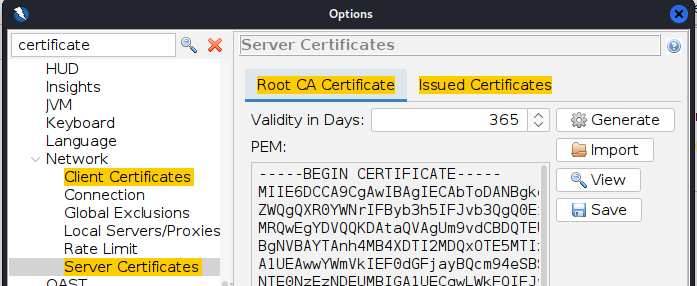

Seuraava vaihe oli lisätä generoitu sertifikaatti Firefoxiin. Tämä onnistui avaamalla ensin Firefox ja avaamalla selaimen asetukset. Firefoxin asetuksia pystyi myös rajaamaan hakusanoilla. Certificates -> View Certificates sai avattua Certificate Managerin. Aiemmin tallennettu sertifikaatti tiedosto haettiin ja tuotiin Importin kautta. Certificate Manager kysyi lisäämisen kohdalla sertifikaatin luottamuksesta, johon vastasin "Trust this CA to identify websites". Tämän jälkeen lisäämäni sertifikaatti näkyi listan lopussa.

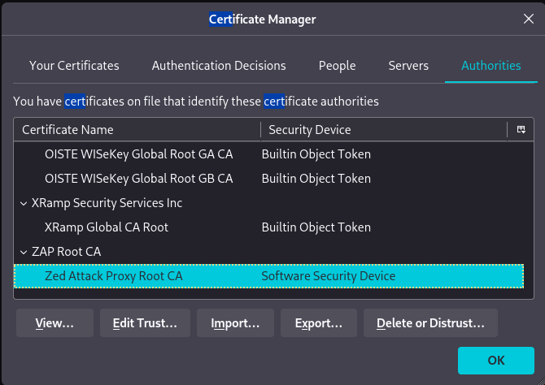

### ZAP proxyksi selaimeen

Rajasin nyt Firefoxin asetuksia hakusanalla ``proxy`` ja valitsin tulokseksi saadun Network Settingsin asetukset. Asetuksista valitsin proxyn manuaalisen konfiguroinnin ja syötin tähän IP-osoitteeksi ``127.0.0.1`` ja portiksi ``8080``. Täppäsin myös kohdan, että proxyä käytetään myös HTTPS:ssä.

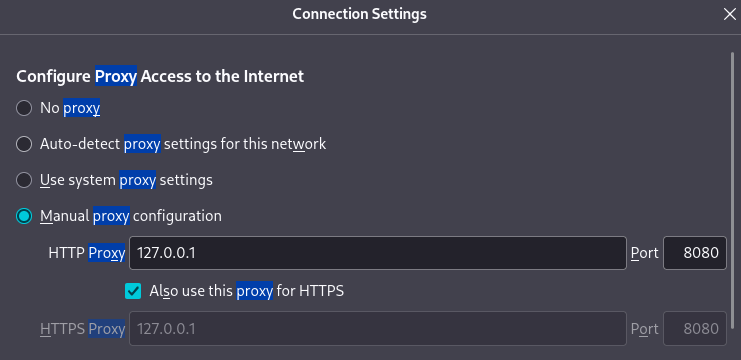

Tehtävänannon vinkkien perusteella sallin Firefoxin edistyneissä ``about:config``-asetuksissa myös localhostiin suuntautuvan liikenteen ohjaamisen selaimesta ZAP-proxyn kautta. Avasin aluksi selaimella about:config -sivun ja rajasin hakua, kunnes löysin oikean asetuksen: ``network.proxy.allow_hijacking_localhost``. Sallin liikenteen ohjaamisen vaihtamalla falsen trueksi.

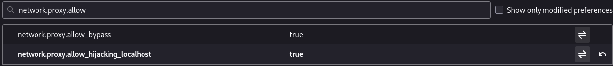

### ZAP sieppaamaan myös kuvia

Palasin takaisin Zaproxyn asetuksiin ja hain asetuksia ``images``-haulla. Display-asetuksista löytyi kohta ``Process images in HTTP requests/responses``. Oletuksena asetus oli pois päältä, joten täppä tähän ja asetukset olivat OK.

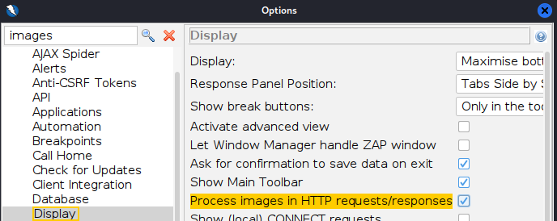

### Osoita ZAP:n toiminta

Kirjauduin PortSwigger Labiin ja avasin tätä kohtaa varten ensimmäisen, myöhemmin kohdassa c) vastaan tulevan harjoituksen. Kun harjoitus oli selaimessa auki, avasin Zaproxyssä uuden session ja päivitin selaimessa olleen harjoitussivun.

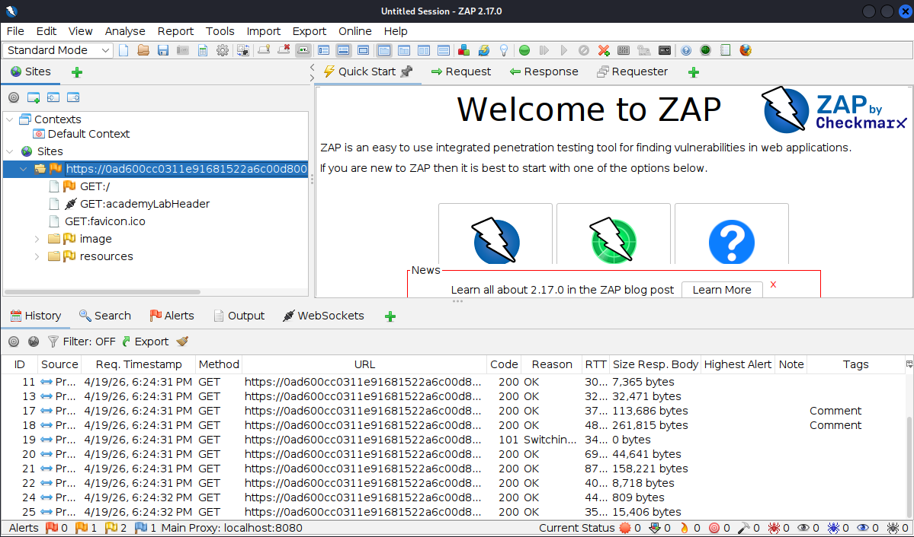

- PortSwigger-labin liikenne näkyi ZAP:n käyttöliittymässä heti sivun päivityksen jälkeen.
- History-näkymään tallentui useita GET-pyyntöjä, joten selaimen liikenne kulki ZAP:n kautta oikein.
- Palvelin vastasi pyyntöihin onnistuneesti, mistä kertoi useissa riveissä näkyvä 200 OK.
- Sites-näkymässä näkyi myös sivun resursseja, kuten favicon.ico, image ja resources.
  - ZAP sieppasi varsinaisen sivupyynnön lisäksi myös kuvia ja muita staattisia tiedostoja.

## b) Kettumaista

>Kettumaista. Asenna "FoxyProxy Standard" Firefox Addon, ja lisää ZAP proxyksi siihen. Käytä FoxyProxyn "Patterns" -toimintoa, niin että vain valitsemasi weppisivut ohjataan Proxyyn.

Asensin Firefoxin FoxyProxy Standard -lisäosan avaamalla selaimen ``Extensions and themes``-valikon ja hakemalla lisäosan nimellä. ``FoxyProxy``-hakusanalla tuli kaksi osumaa, joista toinen oli tehtävään vaadittu Standard. Valittuani oikean lisäosan, asentaminen kävi valitsemalla ``Add to Firefox``. Lisäämisen jälkeen ``Extensions``-valikon alta löytyi nyt FoxyProxy-lisäosa. 

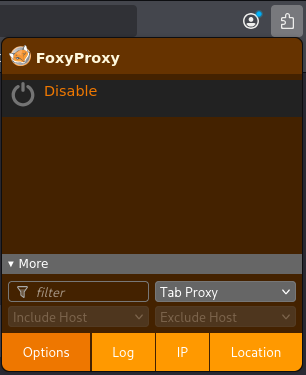

FoxyProxyn asetusten ``Proxies``-välilehdelle tuli tämän jälkeen lisätä ZAP proxyksi. Proxyn täyttämiseen käytin apuna FoxyProxyn [dokumentaatiota](https://help.getfoxyproxy.org/index.php/knowledge-base/url-patterns/).

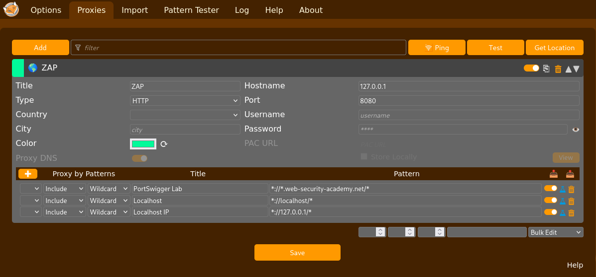

- FoxyProxyssa määritettiin ZAP-proxy osoitteeseen ``127.0.0.1:8080``, ja sille lisättiin kolme patternia. Patternilla tarkoitetaan sääntöä, jonka perusteella FoxyProxy päättää, ohjataanko tietty URL proxyyn vai ei.
- Käytössä olivat Include-säännöt, eli käytännössä whitelistit. FoxyProxyn ohjeen mukaan whitelist määrittää URL-osoitteet, jotka pitää ladata proxyn kautta.
- Pattern-tyypiksi valittiin Wildcard. FoxyProxyn mukaan wildcardissa * vastaa nollaa tai useampaa merkkiä, joten se sopii hyvin osoitejoukkojen rajaamiseen.
- Sääntö ``*://*.web-security-academy.net/*`` ohjaa kaikki PortSwigger Labsin alidomainit ja polut ZAP:n kautta. Näin vain harjoitusympäristöön menevä liikenne välitetään proxyyn.
- Säännöt ``*://localhost/*`` ja ``*://127.0.0.1/*`` ohjaavat paikalliset testikohteet proxyyn. FoxyProxyn ohje painottaa, että localhost ja 127.0.0.1 pitää määrittää kahtena erillisenä patternina.

Asetusten tallentamisen jälkeen avasin ``Extensions``-valikosta FoxyProxyn, ja valitsin käytettäväksi ``Proxy by Patterns``-tilan. Lisäksi kävin vaihtamassa aikaisemmin määrittelemäni ``Network Settingsin`` proxy-asetukset takaisin ``No proxy`` -valintaan. Tällöin Firefoxin globaalit asetukset eivät ainakaan tule sotkemaan lisäosaan luotuja asetuksia.

Testasin viimeisenä FoxyProxyn toimintaa avaamalla uuden session ZAP:ssa. Ensimmäisenä päivitin avoinna olleen PortSwigger Labin sivun, joka kuului määriteltyihin patterneihin. PortSwiggerin liikenne näkyi ZAP:n Sites- ja History-näkymissä, joten se ohjautui proxyyn oikein. Toisena avasin selaimessa sivun ``terokarvinen.com``, joka ei kuulunut määriteltyihin patterneihin. Nyt sivun liikenne ei ilmestynyt ZAP:n näkymiin. Tulosten perusteella FoxyProxy siis ohjasi proxyn kautta vain ennalta määritellyt kohteet eikä kaikkea selaimen liikennettä.

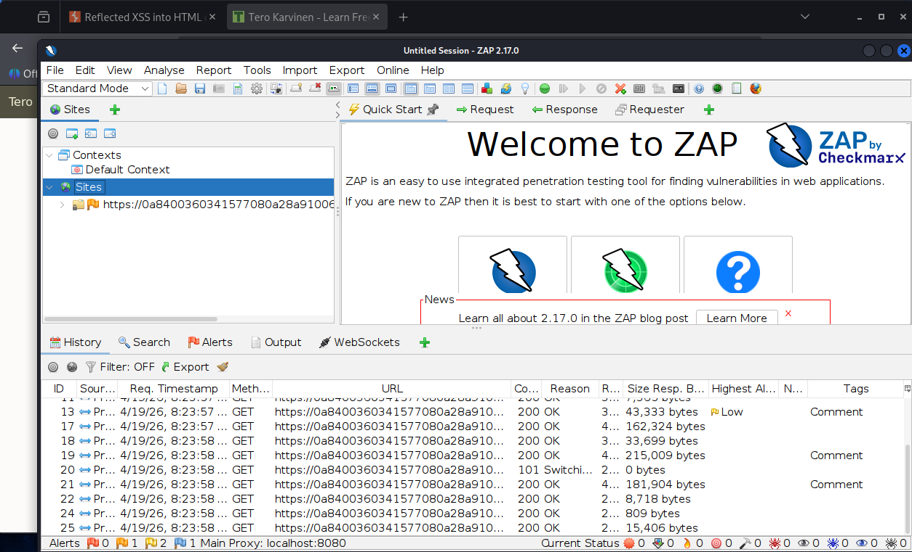

## c) PortSwigger Labs: Reflected XSS into HTML context with nothing encoded

> This lab contains a simple reflected cross-site scripting vulnerability in the search functionality.
> To solve the lab, perform a cross-site scripting attack that calls the alert function

Tehtävässä käytetty apuna PortSwigger Academyn dokumentaatiota [Reflected XSS-hyökkäyksestä](https://portswigger.net/web-security/cross-site-scripting/reflected).

- Ratkaisu:
  - Testasin ensin hakukenttää normaalilla merkkijonolla ``mopoauto``.
  - Haku muodosti URL-osoitteen ``*.web-security-academy.net/?search=mopoauto``, joten käyttäjän syöte kulki palvelimelle HTTP-pyynnön parametrina.
    - Dokumentaation mukaan Reflected XSS syntyy juuri silloin, kun sivusto vastaanottaa dataa HTTP-pyynnössä ja sisällyttää sen heti vastaukseen turvattomalla tavalla.
  - Tämän jälkeen korvasin hakutermin XSS-payloadilla ``<script>alert(1)</script>``
  - URL-osoite on siis ``*.web-security-academy.net/?search=<script>alert(1)</script>``
  - Selain suoritti JavaScriptin ja avasi alert-ikkunan.
  - 
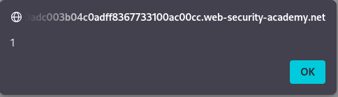

- Hyökkäys löytyi testaamalla ensin tavallisella hakusanalla, että search-parametrin arvo heijastuu takaisin sivulle.      
  - Dokumentaation mukaan manuaalisessa testauksessa kannattaa ensin syöttää satunnainen arvo, tarkistaa heijastus ja vasta sitten testata payloadia.
- Palvelimella tapahtui se, että search-parametrin sisältö upotettiin HTML-vastaukseen ilman turvallista käsittelyä. 
  - Koska syöte päätyi HTML-kontekstiin muuttumattomana, selain tulkitsi script-tagin suoritettavana koodina eikä tekstinä.
- Vika johtuu siitä, että käyttäjän syöte palautetaan vastaukseen ilman turvallista käsittelyä.
  - Dokumentaation mukaan reflected XSS:n estossa keskeistä on ymmärtää heijastuksen konteksti ja suojata data erityisesti output encodingilla (esim < ja > muuttuvat ``&lt;`` ja ``&gt;`` tekstiksi).

## d) PortSwigger Labs: Stored XSS into HTML context with nothing encoded

> This lab contains a stored cross-site scripting vulnerability in the comment functionality.
> To solve this lab, submit a comment that calls the alert function when the blog post is viewed. 

Tehtävässä käytetty apuna PortSwigger Academyn dokumentaatiota [Stored XSS-hyökkäyksestä](https://portswigger.net/web-security/cross-site-scripting/stored).

- Ratkaisu:
  - Testasin ensin kommenttikenttää tavallisella tekstillä varmistaakseni, että syöte todella tallentuu ja näkyy myöhemmin blogipostauksen alla.
  - Tämän jälkeen syötin kommenttiin XSS-payloadin ``<script>alert(1)</script>``.
  - Kun blogipostaus avattiin kommentin lähettämisen jälkeen, selain suoritti JavaScriptin ja avasi alert-ikkunan. 
    - Dokumentaation mukaan stored XSS syntyy, kun sivusto vastaanottaa epäluotettavaa dataa ja sisällyttää sen myöhempiin HTTP-vastauksiin turvattomalla tavalla.
- Hyökkäys löytyi testaamalla ensin normaalilla kommentilla, että kommenttilomake toimii tässä haavoittuvuuden entry pointina ja blogisivu kommentin näyttöpaikkana eli exit pointina.
- Palvelimella tapahtui se, että kommenttilomakkeella lähetetty käyttäjän syöte tallennettiin sovellukseen ja lisättiin myöhemmin blogisivun HTML-vastaukseen. 
  - Tässä labissa syöte päätyi HTML-kontekstiin ilman encodingia, joten selain tulkitsi script-tagin suoritettavana koodina eikä tavallisena tekstinä
- Vika johtuu siitä, että sivusto tallentaa käyttäjän syötteen ja näyttää sen myöhemmin ilman turvallista käsittelyä.
  - Haavoittuvuuden estäminen edellyttää kontekstin ymmärtämistä ja turvallista output encodingia ennen datan näyttämistä.

## e) Mitä hyökkääjä hyötyy XSS-hyökkäyksestä?

>Selitä esimerkin avulla, mitä hyökkääjä hyötyy XSS-hyökkäyksestä. Alert("Hei Tero!") ei vielä tarjoa kummoista pääsyä.

``Alert()`` ei ole hyökkäyksen varsinainen tavoite, vaan merkki siitä, että hyökkääjä pystyy ajamaan omaa koodiaan uhrin selaimessa saman sivuston kontekstissa.

## f) PortSwigger Labs: File path traversal, simple case

> This lab contains a path traversal vulnerability in the display of product images.
> To solve the lab, retrieve the contents of the /etc/passwd file. 

Tehtävässä käytetty apuna PortSwigger Academyn dokumentaatiota [Path traversalista](https://portswigger.net/web-security/file-path-traversal#what-is-path-traversal).

- Ratkaisu:
  - Dokumentaation mukaan path traversal tarkoittaa haavoittuvuutta, jossa käyttäjän syöte päätyy tiedostopolkuun ja sen avulla voidaan lukea palvelimelta mielivaltaisia tiedostoja.
  - Silmäilin sivustoa ja huomasin, että tässä tehtävässä tuotekuvat haetaan pyynnöllä, jossa kuvatiedoston nimi annetaan parametrissa ``filename``.

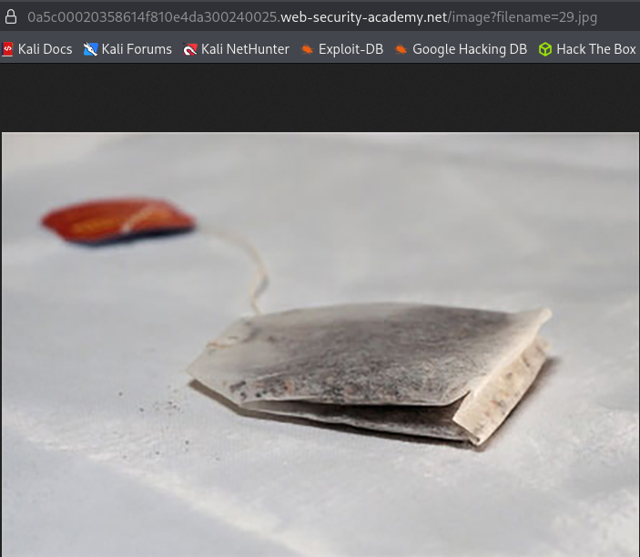

  - Koska kyseessä oli simple case, kokeilin suoraan traversal-syötettä ``../../../etc/passwd``.
    - Muokattu pyyntö oli siis ``/image?filename=../../../etc/passwd``.
    - Tämä ei kuitenkaan toiminut.
      - ``The image ".../image?filename=../../../etc/passwd" cannot be displayed because it contains errors.`` <sup><font color="red">*lisätty palautuksen jälkeen</font></sup>
      - Developer Toolsin silmäily ei antanut enempää vastauksia <sup><font color="red">*lisätty palautuksen jälkeen</font></sup>

Jatkan ratkomista ZAP:n avulla myöhemmin, aika loppui kesken palautukseen.

 :exclamation::exclamation:<font color="red">EDIT: Tästä eteenpäin tehtävää on tehty palautuksen jälkeen</font> :exclamation::exclamation:

Palasin samaan pisteeseen, mihin ennen palautusta jäin. Minulla oli edessäni avattuna uudestaan tuotekuva, jonka URL-parametrissa oli ``filename``.

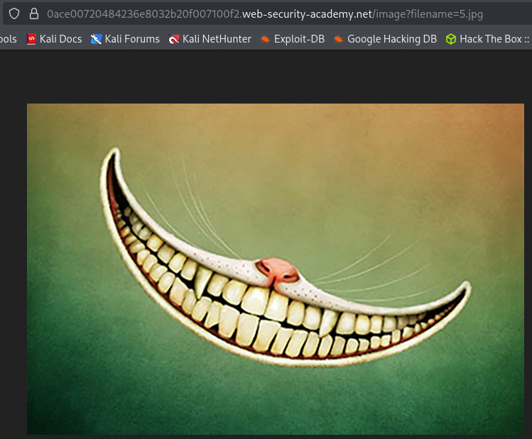

Lähdin tällä kertaa tutkimaan ratkaisua ZAP:n kautta. ZAP:n historiasta viimeinen tallennettu liikenne piti sisällään hetki sitten avaamani tuotakuvan sivu.

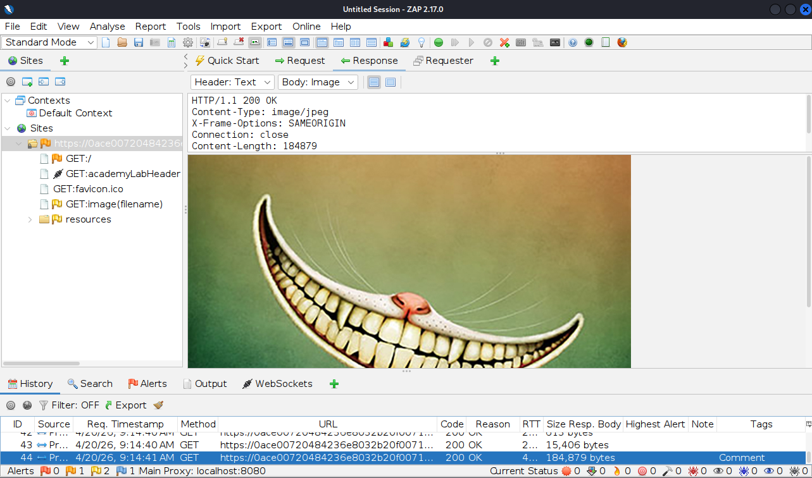

ZAP:n Request-välilehdeltä löytyi ``GET https://0ace00720484236e8032b20f007100f2.web-security-academy.net/image?filename=5.jpg HTTP/1.1``-pyyntö, jonka kopioin Requesteriin. Requester on ZAP:n työkalu, jolla voi muokata ja lähettää pyyntöjä manuaalisesti uudelleen. Kopioimani pyyntö palautti vastauksena samaisen virnistyksen.

Muokkasin seuraavaksi GET-pyyntöä eilisen traversal-pyynnön mukaisesti. Vaihdoin ``filename=5.jpg`` kuvatiedoston ``filename=../../../etc/passwd`` poluksi, ja lähetin pyynnön. Sain vastaukseksi:

    HTTP/1.1 200 OK\
    Content-Type: image/jpeg\
    X-Frame-Options: SAMEORIGIN\
    Connection: close\
    Content-Length: 2316

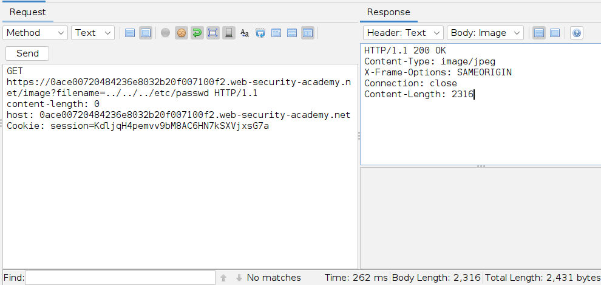

``HTTP/1.1 200 OK`` kertoo, että palvelin hyväksyi pyynnön ja palautti resurssin. Se ei viittaa estoon tai virheeseen. Lisäksi ``Content-Length: 2316`` osoittaa, että vastauksessa on oikeasti dataa mukana, joten endpoint ei palauttanut tyhjää tai pelkkää virhesivua. Tässä kohtaa tunsin olevani lähellä ratkaisua, mutta jokin oli vielä ``/etc/passwd``-tiedoston tiellä.

Pienen motivaatiotauon jälkeen tutkin vastausta uudestaan ja tajusin ristiriidan: olin pyytänyt ``../../../etc/passwd``-tiedostoa, mutta palvelin ilmoitti vastauksen tyypiksi ``image/jpeg``. Tästä pystyi päättelemään, että sisältö palautui image-endpointin kautta, vaikka kyse ei ollut kuvasta.

Siksi ZAP yritti näyttää bodyn kuvana. Kun vaihdoin näkymän tekstiksi, sain esiin /etc/passwd-tiedoston sisällön ja varmistin, että path traversal oli onnistunut.

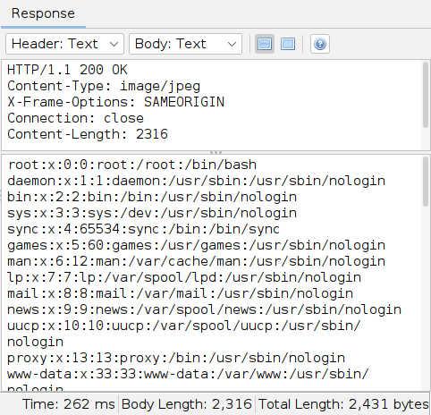

- Hyökkäys löytyi tutkimalla, miten sivusto lataa tuotekuvia. Kuvan URL:ssa käyttäjän syöte meni suoraan ``filename``-parametriin.
- Palvelimella tapahtui se, että sivusto käytti kuvan nimeä osana tiedostopolkua. 
  - Dokumentaation mukaan tyypillinen toteutus on, että sivusto liittää käyttäjän antaman tiedostonimen ennalta määrättyyn hakemistoon, esimerkiksi ``/var/www/images/``, ja lukee sitten kyseisen tiedoston filesystem-API:lla.
- Hyökkäys toimi, koska ``../`` tarkoittaa siirtymistä yhden hakemistotason ylöspäin. 
  - Kun parametriksi annettiin ``../../../etc/passwd``, hakemistossa päädyttiin juureen asti, ja luettava tiedosto oli ``/etc/passwd``.
- Vika johtuu siitä, että sivusto ei rajoittanut käyttäjän antamaa polkua turvallisesti.
  - Dokumentaation mukaan path traversal syntyy, kun käyttäjän syöte välitetään tiedostojärjestelmän käsittelyyn ilman riittävää validointia.
  - Haavoittuvuuden estäminen edellyttäisi, että käyttäjän syötettä ei välitetä suoraan filesystem-API:lle.


## g) PortSwigger Labs: File path traversal, traversal sequences blocked with absolute path bypass

Editoin tehtävän myöhemmin, aika loppui kesken palautukseen.

 :exclamation::exclamation:<font color="red">EDIT: Tästä eteenpäin tehtävää on tehty palautuksen jälkeen</font> :exclamation::exclamation:

>This lab contains a path traversal vulnerability in the display of product images. \
>The application blocks traversal sequences but treats the supplied filename as being relative to a default working directory. \
>To solve the lab, retrieve the contents of the /etc/passwd file.

Tehtävässä käytetty apuna PortSwigger Academyn dokumentaatiota [Path traversalista](https://portswigger.net/web-security/file-path-traversal#what-is-path-traversal).


Lähestyin tätä tehtävää tällä kertaa suoraan ZAP:ssa. Dokumentaation mukaan ``../``-sekvenssit eivät tällä kertaa toimi, mutta se ei estä absoluuttista polkua.

Etsin ZAP:sta ensin pyynnön, josta löytyi kuva. Löysin pyynnön ``GET /image?filename=31.jpg``, ja sen response palautti normaalisti kuvatiedoston. Kopioin tämän GET-pyynnön Requesteriin ja varmistin vielä, että sama kuva palautui myös sitä kautta.

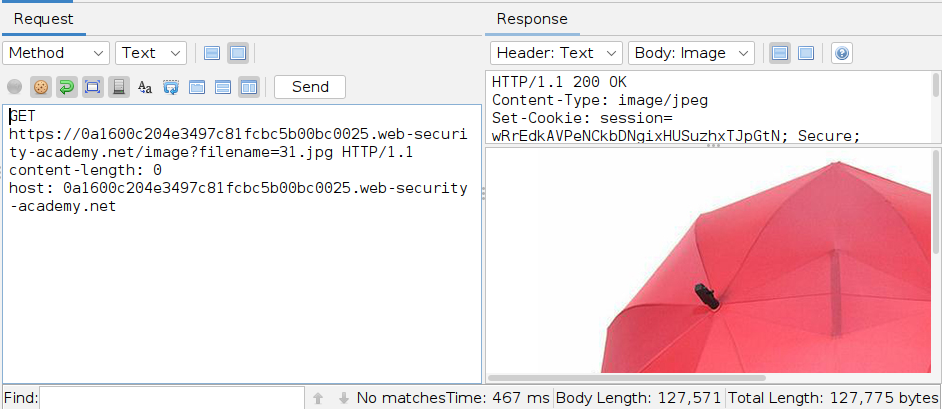

Testasin seuraavaksi, mitä tapahtuisi, jos lähettäisin silti ``../``-sekvenssejä sisältävän pyynnön. Vastaukseksi tuli ``HTTP/1.1 400 Bad Request``, mikä osoitti, että sivusto tunnisti traversal-yrityksen ja hylkäsi pyynnön jo ennen tiedoston lukemista.

Tämän jälkeen poistin ``../``-sekvenssit kokonaan ja lähetin pyynnön uudelleen käyttäen ``filename``-parametrina suoraan absoluuttista polkua ``/etc/passwd``. Tällä kertaa palvelin vastasi onnistuneesti ``HTTP/1.1 200 OK``, ja response sisälsi ``/etc/passwd``-tiedoston rivit, kuten ``root:x:0:0:root:/root:/bin/bash``.

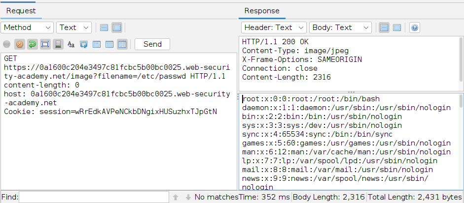

- Hyökkäys löytyi taas tutkimalla, miten sivusto lataa tuotekuvia. Kuvan URL:ssa käyttäjän syöte meni suoraan ``filename``-parametriin, joten sitä pystyi testaamaan tiedostopolkuna.
- Palvelimella tapahtui se, että sivusto käytti ``filename``-parametria tiedoston lukemiseen palvelimelta image-endpointin kautta. 
  - Dokumentaation mukaan tämä tehdään tyypillisesti niin, että käyttäjän syöte liitetään tiedostopolkuun ja luetaan filesystem-API:lla.
- Uusi havainto tässä harjoituksessa oli se, että ``../``-sekvenssit oli estetty. Tämä näkyi käytännössä siinä, että traversal-yritys johti virhevastaukseen.
  - Hyökkäys onnistui silti, koska sivusto hyväksyi absoluuttisen polun. 
  - Dokumentaation mukaan jos traversal-sekvenssit estetään, suojauksen voi joskus ohittaa antamalla tiedostonimen suoraan absoluuttisena polkuna, kuten ``filename=/etc/passwd``.
- Vika johtuu siitä, että sivusto ei rajannut käyttäjän syötettä turvallisesti sallittuun hakemistoon. Vaikka ``../``-sekvenssit oli blokattu, käyttäjän syöte päätyi edelleen filesystem-käsittelyyn liian luottavaisesti.
- Haavoittuvuuden estäminen edellyttäisi samaa kuin edellisessä tehtävässä: käyttäjän syötettä ei pitäisi välittää suoraan filesystem-API:lle.

## h) PortSwigger Labs: File path traversal, traversal sequences stripped non-recursively

Editoin tehtävän myöhemmin, aika loppui kesken palautukseen.

:exclamation::exclamation:<font color="red">EDIT: Tästä eteenpäin tehtävää on tehty palautuksen jälkeen</font> :exclamation::exclamation:

> This lab contains a path traversal vulnerability in the display of product images.\
> The application strips path traversal sequences from the user-supplied filename before using it.\
> To solve the lab, retrieve the contents of the /etc/passwd file. 

Tehtävässä käytetty apuna PortSwigger Academyn dokumentaatiota [Path traversalista](https://portswigger.net/web-security/file-path-traversal#what-is-path-traversal).

Lähestyin tätä tehtävää jälleen suoraan ZAP:ssa. Tehtävänannon mukaan sivusto poistaa path traversal -sekvenssejä käyttäjän syötteestä ennen tiedoston lukemista, joten pelkkä tavallinen ``../`` ei tässä tapauksessa todennäköisesti riitä. Dokumentaation perusteella tällainen suojaus voidaan joskus ohittaa käyttämällä sisäkkäisiä traversal-sekvenssejä ``....//``, jotka palautuvat toimiviksi ``../``-muodoiksi, mikäli sivusto poistaa sekvenssit vain kerran.

Etsin ZAPista ensin pyynnön, josta löytyi kuva. Löysin pyynnön ``GET /image?filename=37.jpg``, ja sen response palautti normaalisti kuvatiedoston. Kopioin tämän GET-pyynnön Requesteriin ja varmistin vielä, että sama kuva palautui myös sitä kautta.

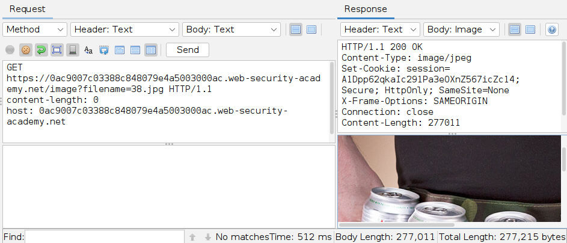

Tämän jälkeen muokkasin ``filename``-parametria ja testasin, voiko suodatuksen ohittaa sisäkkäisellä traversal-muodolla ``....//``. Ajatuksena oli, että jos sivusto tosiaan poistaa ``../``-sekvenssit vain kerran, syötteestä voi jäädä jäljelle edelleen toimiva traversal-pätkä, jolloin tiedostopolku ei enää rajoitu kuvahakemistoon.

Tämä toimi, ja palvelin palautti vastaukseksi ``/etc/passwd``-tiedoston sisällön. Vastauksessa näkyi mm. rivi ``root:x:0:0:root:/root:/bin/bash``, mikä vahvisti sivuston suodattaneen traversal-sekvenssejä vain kerran.

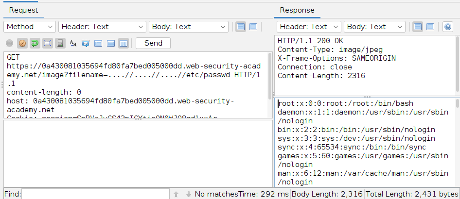

- Hyökkäys löytyi tutkimalla taas, miten sivusto lataa tuotekuvia. Kuvan URL:ssa käyttäjän syöte meni suoraan ``filename``-parametriin, joten sitä pystyi testaamaan tiedostopolkuna.
- Palvelimella tapahtui se, että image-endpoint käytti ``filename``-parametria tiedoston lukemiseen.
- Uusi havainto oli se, että sivusto kyllä poisti traversal-sekvenssejä, mutta vain kerran.
  - Tästä syystä hyökkäys onnistui, sillä suodatuksen jälkeen polku muuttui käytännössä traversal-muotoon.
- Vika johtuu siitä, että sovellus luotti liikaa merkkijonotason suodatukseen.

## i) PortSwigger Labs: Insecure direct object references

Editoin tehtävän myöhemmin, aika loppui kesken palautukseen.

 :exclamation::exclamation:<font color="red">EDIT: Tästä eteenpäin tehtävää on tehty palautuksen jälkeen</font> :exclamation::exclamation:

> This lab stores user chat logs directly on the server's file system, and retrieves them using static URLs. \
> Solve the lab by finding the password for the user carlos, and logging into their account.

Tehtävässä käytetty apuna PortSwigger Academyn dokumentaatiota [IDOR:sta](https://portswigger.net/web-security/access-control/idor).

Tehtävänannon mukaan lokit tallennetaan palvelimen tiedostojärjestelmään ja haetaan staattisilla URL-osoitteilla, mikä viittasi suoraan IDOR-haavoittuvuuteen.

Aloitin silmäilemällä sivustoa ja käymällä läpi sen näkyviä toimintoja. Etusivulta löytyivät linkit ``Home``, ``My account`` ja ``Live chat``. ``Home``-sivu oli näkymä, joka aukesi oletuksena. ``My accountin`` takaa löytyi kirjautumisikkuna, mikä ei toiminut admin-admin -kentillä. ``Live chatissa`` pystyi kirjoittamaan viestejä ja tallentamaan keskustelun. Kun tallensin oman keskusteluni, sovellus latasi tiedoston nimeltä ``2.txt``.

Vaihdoin tämän tiedon jälkeen ZAP:n puolelle ja etsin historiasta kyseisen ``GET /download-transcript/2.txt`` -pyynnön. Kopioin löytämäni pyynnön Requesteriin ja lähetin pyynnön. Sain vastaukseksi hetki sitten käydyn keskustelun.

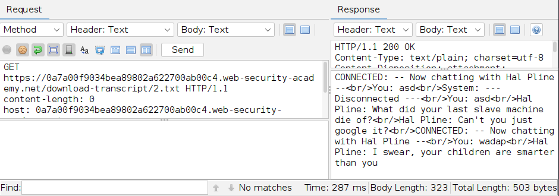

Seuraava kysymys olikin, mitä jos lähetän ````GET /download-transcript/1.txt`` -pyynnön? Vastaukseksi sain keskustelun, jota minun ei olisi koskaan pitänyt pystyä näkemään. Keskustelusta löytyi tarvitsemani salasana.

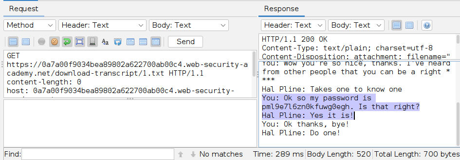

Siirryin ``My account``-sivulle ja syötin tehtävänannossa annetun tunnuksen ``carlos`` ja löytämäni salasanan. Kirjautuminen onnistui ja tehtävä oli suoritettu.

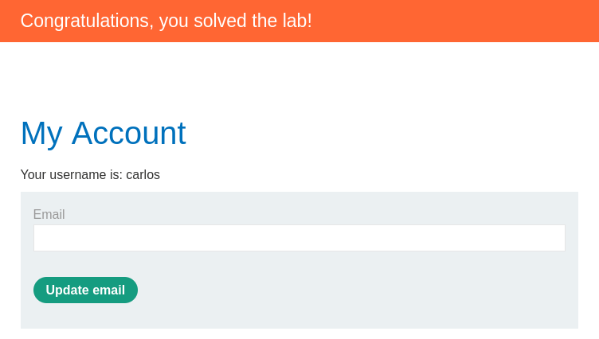

- Hyökkäys löytyi tutkimalla, miten sovellus tallentaa ja hakee live chat -keskusteluja. 
  - Kun tallensin oman keskustelun, sovellus latasi tiedoston 2.txt, mikä paljasti, että chat-lokit haetaan suoraan staattisina tiedostoina URL-osoitteella.
- Palvelimella tapahtui se, että sovellus tallensi keskustelulokit tiedostojärjestelmään ja palautti ne pyydettäessä suoraan tiedostonimen perusteella.
  - Dokumentaation mukaan access control määrittää, saako käyttäjä käyttää tiettyä resurssia, ja IDOR syntyy juuri silloin, kun käyttäjän syötettä käytetään objektin suoraan hakemiseen ilman riittävää tarkistusta.
- Vika johtuu puutteellisesta pääsynvalvonnasta. 
  - Sovellus luotti siihen, että käyttäjä pyytää vain omaa lokitiedostoaan, mutta ei sitonut pyydettyä resurssia kirjautuneeseen käyttäjään.
- Turvallinen toteutus edellyttäisi, että palvelin tarkistaa jokaisella pyynnöllä pyydetyn tiedoston varmasti kuuluvan kirjautuneelle käyttäjälle.

## Lähteet

Tero Karvinen
- Tunkeutumistestaus, H4 Täysin Laillinen Sertifikaatti: https://terokarvinen.com/tunkeutumistestaus/#h4-taysin-laillinen-sertifikaatti

OWASP Top 10:2021 Documentation
- A01:2021 – Broken Access Control: https://owasp.org/Top10/2021/A01_2021-Broken_Access_Control/index.html

PortSwigger Academy
- Insecure direct object references (IDOR): https://portswigger.net/web-security/access-control/idor
- Path traversal: https://portswigger.net/web-security/file-path-traversal
- Cross-site scripting (XSS): https://portswigger.net/web-security/cross-site-scripting
- XSS Reflected: https://portswigger.net/web-security/cross-site-scripting/reflected

FoxyProxy Docs
- URL Patterns: https://help.getfoxyproxy.org/index.php/knowledge-base/url-patterns/