# h4 Täysin Laillinen Sertifikaatti

Viikon läksyjen tarkemmat tehtävänannot löytyvät kurssin [sivuilta](https://terokarvinen.com/tunkeutumistestaus/#h5-Fuzzy).

### Kurssilla käytetty työympäristö
- Lenovo Yoga Slim 7 Pro (AMD Ryzen 7 5800H @ 3.20 GHz, 16 GB DDR4-3200, NVIDIA GeForce RTX 3050 laptop 4 GB GDDR6). WIN11, versio 25H2.
- Oracle VirtualBox 7.2.6
  - Linux Kali 2026.1 x64, 4 GB RAM, 2 prosessoria
  - Metasploitable 2, 2 GB RAM
- Molemmat virtuaalikoneet ovat host-only verkossa.
  - VirtualBox Host-Only Ethernet Adapter #2.
    - Adapteri konfiguroitu manuaalisesti, DHCP Server käytössä.

## x) Lue ja tiivistä

### Tero Karvinen 2023: Find Hidden Web Directories - Fuzz URLs with ffuf

> Lue ja tiivistä muutamilla ranskalaisilla viivoilla annetut artikkelit.

Ensimmäinen lukutehtävä: Tero Karvinen 2023, [Find Hidden Web Directories - Fuzz URLs with ffuf](https://terokarvinen.com/2023/fuzz-urls-find-hidden-directories/).

- Web-palvelimilla voi olla piilotettuja hakemistoja, joita ei löydy klikkailemalla etusivun valikkoja.
- Niitä voisi etsiä käsin kokeilemalla osoitteita kuten /admin, /secret tai /ihan_varmasti_taalla, mutta siinä menisi ikä ja terveys.
- ffuf automatisoi tämän arvailun sanalistan avulla.
- Käytännössä ffuf koputtelee nopeasti eri URL-oville ja kysyy: “Asuuko täällä joku?”
- Fuzzauksessa ei siis tehdä taikoja, vaan kokeillaan paljon mahdollisia vaihtoehtoja tehokkaasti.
- Työkalua voi käyttää hakemistojen lisäksi myös esimerkiksi HTTP-pyyntöjen eri osien testaamiseen.
- Käytännön esimerkki näyttää, miten ffufilla etsitään paikallisesta testipalvelimesta piilotettu hakemisto sanalistan avulla ja suodatetaan turhat osumat pois.

*Ilman lupaa ffuf on turboahdettu ovikellopila: hauska vain sille, joka painaa nappia.*

### Joona Hoikkala 2023: ffuf README.md

Toinen lukutehtävä: Joona Hoikkala 2023, [ffuf README.md](https://github.com/ffuf/ffuf/blob/master/README.md).

- Ffuf tarkoittaa Fuzz Faster U Fool ja se on Go-kielellä tehty nopea web-fuzzer.
- Työkalu käyttää avainsanaa FUZZ niissä kohdissa pyyntöjä, joihin sanalistan arvoja kokeillaan.
- FUZZ voidaan sijoittaa esimerkiksi URL-polkuun, HTTP-headeriin tai POST-dataan.
- README esittelee yleisiksi käyttötavoiksi mm:
  - Piilotettujen hakemistojen etsimisen.
  - Virtual Hostien etsimisen.
  - GET-parametrien fuzzaamisen.
  - POST-datan fuzzaamisen.
- Tuloksia ei kannata uskoa sokeasti. Ffuf voi löytää paljon “osumia”, mutta osa niistä on digitaalista roskaa.
- Tuloksia voidaan rajata matchereilla ja filttereillä, esim. statuskoodin, vastauskoon, rivimäärän tai sanamäärän perusteella
- Ffuf tukee myös rekursiivista skannausta, aikarajoja, konfiguraatiotiedostoja ja ulkoisia 'mutaattoreja'.
- README korostaa käytännönläheisiä esimerkkejä: peruskomento näyttää usein yksinkertaiselta, mutta tehokkuus tulee suodatuksesta ja oikeasta sanalistasta.

*Ffufin vahvuus vaikuttaa olevan sen yksinkertaisuudessa: laita FUZZ oikeaan paikkaan ja anna työkalun tehdä raskas arvailutyö. Käyttäjälle jää tulosten analysointi, sillä muuten ffufista tulee lähinnä nopea tapa kerätä pitkä lista turhia “löytöjä”.*

## a) Fuzzzz

> Ratkaise dirfuz-1 artikkelista Karvinen 2023: [Find Hidden Web Directories - Fuzz URLs with ffuf](https://terokarvinen.com/2023/fuzz-urls-find-hidden-directories/).

#### Dirfuzt-1
Aloitin tehtävän lataamalla harjoituksessa käytettävän ``dirfuzt-1``-ohjelman kurssin sivuilta komennolla ``$ wget https://terokarvinen.com/2023/fuzz-urls-find-hidden-directories/dirfuzt-1``. Tulosteesta näkyi mm palvelimen vastanneen latauspyyntöön ``200 OK``, mikä tarkoitti latauksen onnistuneen.

Seuraavaksi muokkasin tiedoston käyttöoikeuksia lisäämällä tiedostolle suoritusoikeuden komennolla ``$chmod u+x dirfuzt-1``. Linuxin [man-pagesin](https://man7.org/linux/man-pages/man1/chmod.1.html) mukaan ``chmodin`` ``u`` tarkoittaa tiedoston omistajaa, eli käyttäjää ja ``x`` tässä yhteydessä suoritusoikeutta.

Käynnistin ohjelman nykyisestä hakemistosta komennolla ``$ ./dirfuzt-1``. Ohjelma käynnistyi ja ilmoitti paikallisen osoitteen ``http://127.0.0.2:8000``. Avasin selaimen ja tarkistin ohjelman olevan tosiaankin päällä.

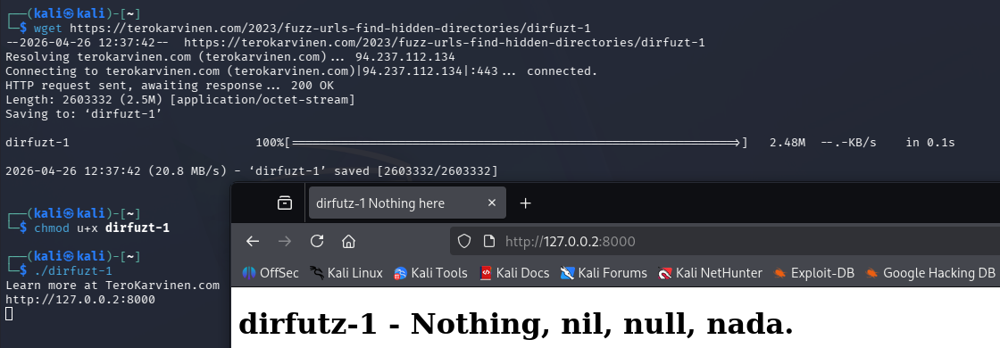

#### Ffuf ja SecList

Seuraavaksi asensin ``ffuf``-työkalun ``$ sudo apt install ffuf``, vaikka Kalissa se olisi todennäköisesti ollut jo valmiina. Asennuksen tarkoituksena oli varmistaa, että työkalu on käytettävissä seuraavaa vaihetta varten.

Tämän jälkeen latasin materiaalin mukaisesti Daniel Miesslerin ynnä muiden kokoaman SecLists-kokoelman komennolla ``$ wget https://raw.githubusercontent.com/danielmiessler/SecLists/master/Discovery/Web-Content/common.txt``. GitHubin [README](https://github.com/danielmiessler/seclists)-kuvauksen mukaan SecLists on tietoturvatestaajan apukokoelma, joka sisältää useita erilaisia tietoturvatestauksessa käytettäviä listoja yhdessä paikassa. Kokoelmasta löytyy esimerkiksi käyttäjänimiä, salasanoja, URL-polkuja, arkaluontoisen datan tunnistemalleja, fuzzing-syötteitä ja web shell -tiedostoja.

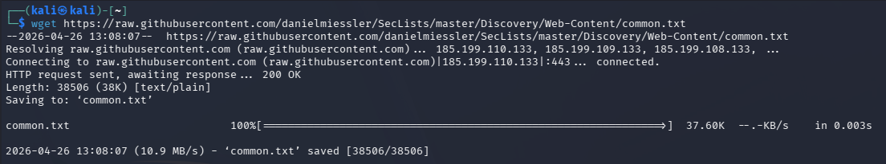

#### Irti verkosta

*"Fuff is very fast. Now might be a good time to disconnect your Internet before you start generating a lot of requests." -Tero Karvinen, 2023*

Ohjeen mukaisesti irroitin tässä kohti virtuaalikoneen julkisesta verkosta Kalin oikean yläkulman verkkoasetuksista valitsemalla ``Wired connection 1 - Disconnect``. ``Wired connection 2`` on Host-only verkko erilaisiin labraharjoituksiin, eikä näin ollen ole julkisessa verkossa.

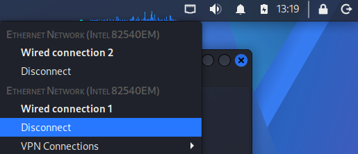

Tarkistin verkon varmasti olevan poikki pingaamalla ``$ ping 8.8.8.8``. Vastaukseksi tuli ``ping: connect: Network is unreachable``, joten virtuaalikone oli irti muusta maailmasta. Tehtävää oli nyt turvallista jatkaa.

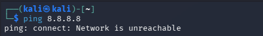

#### Fuzzzaah!

Ajoin fuff-työkalun komennolla ``$ ffuf -w common.txt -u http://127.0.0.2:8000/FUZZ``. [Dokumentaation](https://github.com/ffuf/ffuf/blob/master/README.md) mukaan ``-w common.txt`` määrittää käytettävän sanalistan ja ``-u`` määrittää testattavan kohdeosoitteen. Osoitteen lopussa oleva ``FUZZ`` on paikkamerkki, jonka tilalle ffuf vaihtaa sanalistasta löytyviä sanoja.

Tulosteesta näkyy, että ffuf käytti HTTP-metodia GET (``:: Method ... : GET``)
 ja testasi paikallista osoitetta (``:: URL ... : http://127.0.0.2:8000/FUZZ``).

 Tuloksissa löytyi useita polkuja ja suurin osa palautti samanlaisen vastauksen, kuten:

    .hta                    [Status: 200, Size: 154, Words: 9, Lines: 10, Duration: 2ms]
    .gitreview              [Status: 200, Size: 154, Words: 9, Lines: 10, Duration: 3ms]
    .htaccess               [Status: 200, Size: 154, Words: 9, Lines: 10, Duration: 3ms]
    .gitmodules             [Status: 200, Size: 154, Words: 9, Lines: 10, Duration: 3ms]
    .listings               [Status: 200, Size: 154, Words: 9, Lines: 10, Duration: 4ms]
    .listing                [Status: 200, Size: 154, Words: 9, Lines: 10, Duration: 4ms]
    .htpasswd               [Status: 200, Size: 154, Words: 9, Lines: 10, Duration: 4ms]
    .history                [Status: 200, Size: 154, Words: 9, Lines: 10, Duration: 4ms]
    .perf                   [Status: 200, Size: 154, Words: 9, Lines: 10, Duration: 4ms]
    .passwd                 [Status: 200, Size: 154, Words: 9, Lines: 10, Duration: 5ms]
    .mysql_history          [Status: 200, Size: 154, Words: 9, Lines: 10, Duration: 5ms]
    .git/logs/              [Status: 200, Size: 178, Words: 6, Lines: 11, Duration: 6ms]
    + reilu 4700 muuta riviä

Tulkitsin nämä 154 tavun vastaukset “roskaksi”, koska sama vastaus toistui monella eri polulla ja vaikutti palvelimen oletusvastaukselta. Sen sijaan ``.git/logs/`` oli kiinnostava löydös, koska sen koko oli 178 tavua ja se poikkesi muista vastauksista. Tämän perusteella seuraavassa vaiheessa voidaan suodattaa 154 tavun vastaukset pois ja keskittyä poikkeaviin tuloksiin.

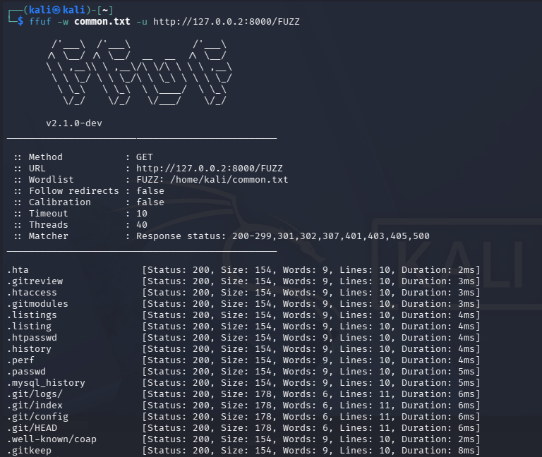

Seuraavaksi ajoin uudestaan fuff-työkalun komennolla `` $ ffuf -w common.txt -u http://127.0.0.2:8000/FUZZ -fs 154``, mutta tällä kertaa suodattaen kaikki 154 tavua pitkät vastaukset pois lisäoptiolla ``-fs 154``.

Tulokset rajoittui nyt huomattavasti lyhyempään listaan:

    .git/index              [Status: 200, Size: 178, Words: 6, Lines: 11, Duration: 5ms]
    .git/HEAD               [Status: 200, Size: 178, Words: 6, Lines: 11, Duration: 4ms]
    .git                    [Status: 301, Size: 41, Words: 3, Lines: 3, Duration: 4ms]
    .git/logs/              [Status: 200, Size: 178, Words: 6, Lines: 11, Duration: 5ms]
    .git/config             [Status: 200, Size: 178, Words: 6, Lines: 11, Duration: 4ms]
    render/https://www.google.com [Status: 301, Size: 64, Words: 3, Lines: 3, Duration: 1ms]
    wp-admin                [Status: 200, Size: 182, Words: 6, Lines: 11, Duration: 2ms]

Näin lyhyestä listasta oli jo helpompi poimia tehtävässä etsittävät kaksi URL-osoitetta: ylläpitosivu sekä versionhallintaan liittyvä sivu. ``wp-admin`` viitannee WordPressin ylläpitosivuun, joten tämä voisi olla haluttu ylläpitosivu. ``.git`` puolestaan liittyy Git-versionhallintaan, ja voisi taas olla versionhallintaan haluttu sivu.

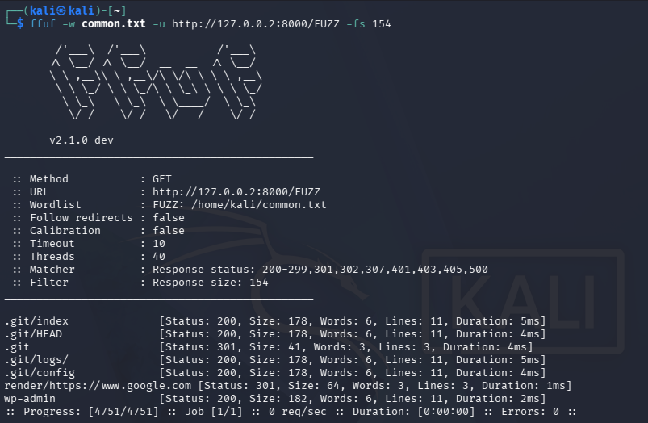

Ensimmäinen yritys: avasin selaimella osoitteen ``http://127.0.0.2:8000/wp-admin`` and that's a bingo! Ylläpitosivu löydetty!

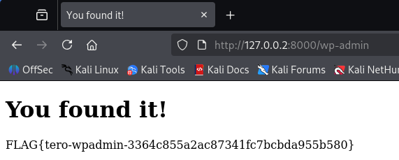

Toinen yritys: avasin selaimessa osoitteen ``http://127.0.0.2:8000/.git`` ja toinen osuma! Versionhallintasivu löydetty!

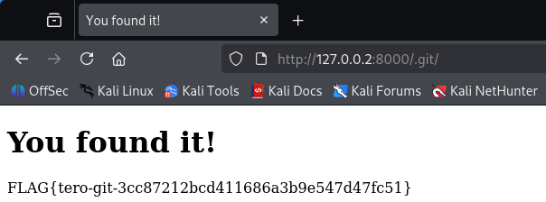

Tehtävän lopuksi suljin ``dirfuzt-1`` -ohjelman ``Ctrl+C``-näppäinyhdistelmällä ja avasin paikallisen osoitteen ``http://127.0.0.2:8000`` tarkistaakseni ohjelman varmasti pysähtyneen. Tämän jälkeen pystyin yhdistämään julkisen verkon ja jatkamaan seuraavaan tehtävään tarvittavia asennuksia.

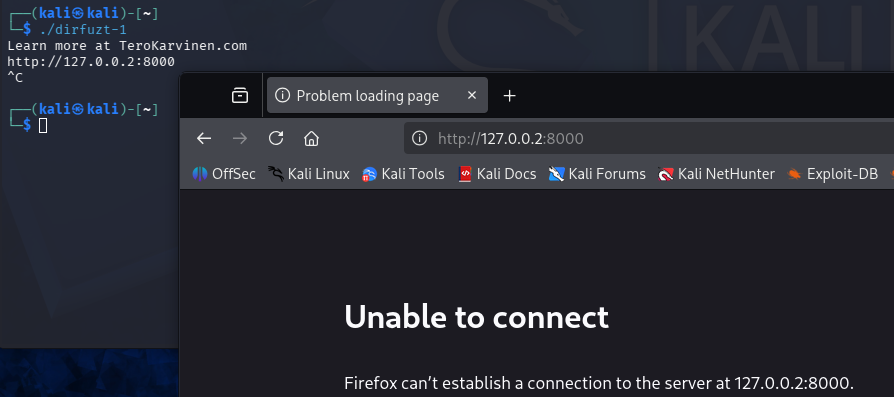

## b) Fuff me

> Asenna FuffMe-harjoitusmaali. Karvinen 2023: [Fuffme - Install Web Fuzzing Target on Debian](https://terokarvinen.com/2023/fuffme-web-fuzzing-target-debian/).

Aloitin ``ffufme``-harjoitusmaalin asentamisen asentamalla ohjeessa mainitut tarvittavat ohjelmat. Ajoin ``$ sudo apt-get install docker.io git`` -komennon, vaikka Kalista nämä varmasti olisi ennestäänkin jo löytynyt. Tehtävään tarvittu ``ffuf`` asennettiin jo uudelleen edellisessä tehtävässä.

Seuraavaksi latasin harjoitusmaalin tiedostot GitHubista komennolla `` $ git clone https://github.com/adamtlangley/ffufme``. Tämän jälkeen siirryin projektin hakemistoon komennolla ``cd ffufme/`` ja loin Docker-imagen komennolla ``sudo docker build -t ffufme .``.

Dockerin [dokumentaation](https://docs.docker.com/reference/cli/docker/image/build/) mukaan komento ``$ sudo docker build -t ffufme .`` luo nykyisestä hakemistosta Docker-imagen ja nimeää sen ``ffufme``:ksi. Docker-image toimii pohjana kontille, eli eristetylle suoritusympäristölle, jossa ``ffufme``-harjoitusmaali voidaan myöhemmin käynnistää.

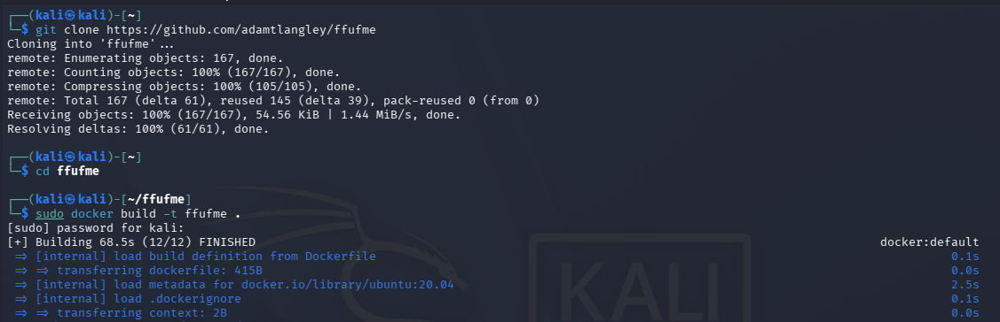

Käynnistin ``ffufme``-harjoitusmaalin komennolla ``$ sudo docker run -d -p 80:80 ffufme``. Dockerin [dokumentaation](https://docs.docker.com/reference/cli/docker/container/run/) mukaan komento luo ja käynnistää uuden Docker-kontin ``ffufme``-imagesta. Optio ``-d`` jättää kontin käyntiin taustalle, ja ``-p 80:80`` yhdistää oman koneen portin 80 kontin porttiin 80. Tämän jälkeen harjoitusmaali oli käytettävissä esimerkiksi selaimella osoitteessa ``http://localhost``.

Ensimmäisellä kerralla avatessani ``localhostin`` selaimessa, sain virheeksi ``The proxy server is refusing connections``. Edellisen viikon harjoituksissa käytetty ``FoxyProxy``-lisäosa oli selaimessa päällä ja selain yritti käyttää toimimatonta proxyä. Poistin ``FoxyProxyn`` käytöstä, minkä jälkeen ``ffufme`` avautui normaalisti.

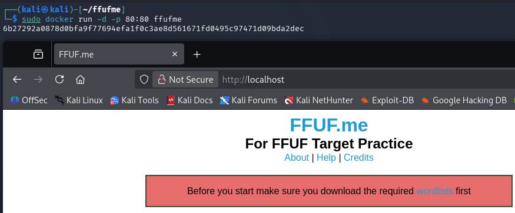

Seuraavaksi loin kotihakemistoon erillisen wordlists-hakemiston ja latasin sinne ffufme-harjoituksessa käytettävät sanalistat. Latausten jälkeen tarkistin vielä sanalistojen löytyvän kansiosta, ennen kuin palasin takaisin ``ffufme``-hakemistoon.

    $ mkdir $HOME/wordlists
    $ cd $HOME/wordlists
    $ wget http://ffuf.me/wordlist/common.txt
    $ wget http://ffuf.me/wordlist/parameters.txt
    $ wget http://ffuf.me/wordlist/subdomains.txt
    $ ls
    $ cd -

Fuffme:n asennus onnistui ilman ongelmia. Asennuksen jälkeen irroitin Kalin jälleen verkosta, ja tarkistin verkon tilan pingaamalla ``$ ping 8.8.8.8``. Vastauksen ollessa ``ping: connect: Network is unreachable`` pystyin jatkamaan itse harjoituksiin.

## Fuffme harjoitukset

> Ratkaise ffufme harjoitukset - kaikki paitsi ei "Content Discovery - Pipes". \

Tehtävissä hyödynnetty fuff:n dokumentaatiota: https://github.com/ffuf/ffuf/blob/master/README.md 

### c) Basic Content Discovery

Ensimmäinen ``ffufme``-harjoitus oli Content Discovery - Basic. Sivun ohjeen mukaan tarkoituksena oli tehdä perusfuzzaus ja löytää piilotetut tiedostot ``class`` ja ``development.log``.

Ajoin harjoituksen ohjeen mukaisen komennon ``$ ffuf -w ~/wordlists/common.txt -u http://localhost/cd/basic/FUZZ``. Dokumentaation perusteella ``-w ~/wordlists/common.txt`` määritti käytettävän sanalistan. ``-u http://localhost/cd/basic/FUZZ`` määritti kohdeosoitteen, ja ``FUZZ`` toimi paikkamerkkinä, jonka tilalle ffuf vaihtoi sanalistasta löytyviä sanoja.

Vastauksesta löytyi kaksi riviä:

    class                   [Status: 200, Size: 19, Words: 4, Lines: 1, Duration: 18ms]
    development.log         [Status: 200, Size: 19, Words: 4, Lines: 1, Duration: 25ms]

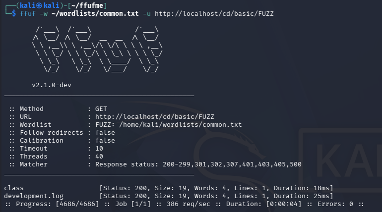

Koska ``ffuf`` sai molemmista riveistä vastauksen ``Status: 200``, palvelin palauttaa niille sisältöä. Selaimessa pitäisi siis näkyä tiedoston sisältö tai palvelimen palauttama vastaus. Avasin ``http://localhost/cd/basic/class`` ja ``http://localhost/cd/basic/development.log`` ja sain varmistuksen tehtävän onnistumisesta.

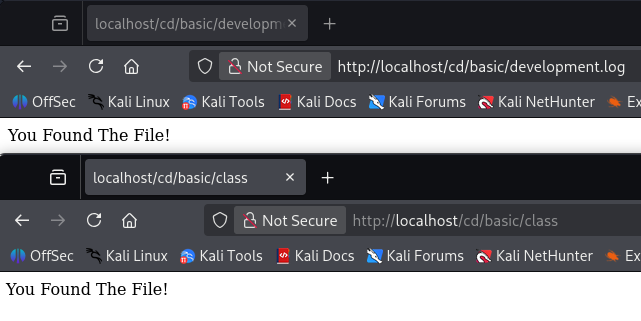

### d) Content Discovery With Recursion

Toisessa ``ffufme``-harjoituksessa tehtävänä oli tehdä rekursiivinen hakemistojen etsintä. Harjoitus oli samankaltainen kuin ensimmäinen perusfuzzaus, mutta tällä kertaa käytettiin -recursion-optiota.

Ajoin harjoituksen ohjeen mukaisen komennon ``$ ffuf -w ~/wordlists/common.txt -recursion -u http://localhost/cd/recursion/FUZZ``. Dokumentaation mukaan ``-recursion`` tarkoittaa, että ``ffuf`` jatkaa hakua automaattisesti löydettyjen hakemistojen sisältä. Tämä näkyi tuloksissa siten, että ensin löytyi ``admin``, minkä jälkeen haku jatkui automaattisesti sen sisältä. Seuraavaksi löytyi ``users``, ja lopulta tiedosto ``96``.

    admin                   [Status: 301, Size: 0, Words: 1, Lines: 1, Duration: 41ms]
    [INFO] Adding a new job to the queue: http://localhost/cd/recursion/admin/FUZZ
    [INFO] Starting queued job on target: http://localhost/cd/recursion/admin/FUZZ
    users                   [Status: 301, Size: 0, Words: 1, Lines: 1, Duration: 18ms]
    [INFO] Adding a new job to the queue: http://localhost/cd/recursion/admin/users/FUZZ
    [INFO] Starting queued job on target: http://localhost/cd/recursion/admin/users/FUZZ
    96                      [Status: 200, Size: 19, Words: 4, Lines: 1, Duration: 13ms]

Löydetty polku ``http://localhost/cd/recursion/admin/users/96`` vastasi tehtävässä odotettua rakennetta. Tehtävän onnistuminen varmistui avaamalla polku selaimessa.

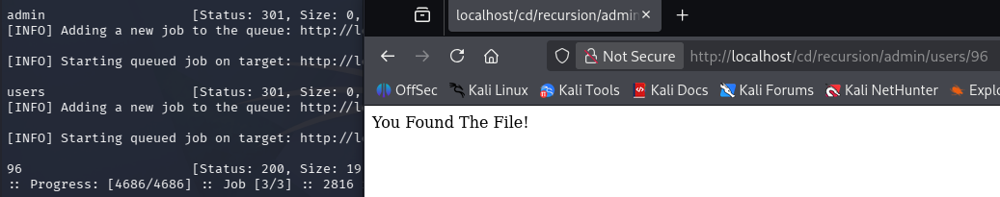

### e) Content Discovery With File Extensions

Kolmannessa ``ffufme``-harjoituksessa tehtävänä oli etsiä tiedostoja tietyn tiedostopäätteen avulla. Harjoituksen mukaan kohteesta oli löytynyt ``/logs``-hakemisto, mutta sen sisältöä ei voitu listata suoraan selaimessa.

Ajoin harjoituksen ohjeen mukaisen komennon ``$ ffuf -w ~/wordlists/common.txt -e .log -u http://localhost/cd/ext/logs/FUZZ``. Dokumentaation mukaan optio ``-e .log`` lisäsi ``.log``-päätteen sanalistan sanojen perään. Käytännössä ``ffuf`` kokeili siis esimerkiksi muotoa ``kayttajat.log``. Tuloksena löytyi ``users.log``, joka palautti HTTP-statuksen ``200``.

    users.log               [Status: 200, Size: 19, Words: 4, Lines: 1, Duration: 18ms]

Tarkistin löydöksen selaimessa avaamalla osoitteen ``http://localhost/cd/ext/logs/users.log``. Sivulla näkyi teksti ``You Found The File!``, mikä vahvisti tehtävän onnistuneen.

### f) No 404 Status

Seuraavassa ``ffufme``-harjoituksessa käsiteltiin tilannetta, jossa palvelin ei palauta puuttuvista sivuista normaalia ``404 Not Found`` -virhekoodia.

Ajoin ensimmäisenä ffuf:n peruskomennon ``$ ffuf -w ~/wordlists/common.txt -u http://localhost/cd/no404/FUZZ``. Vastaus palautti vajaan 4700 riviä eri polkuja, jotka näyttivät "roskalta". Vastauksien poluilla oli kaikilla toistuvasti sama koko: ``669``-tavua.

    .web                    [Status: 200, Size: 669, Words: 126, Lines: 23, Duration: 4ms]
    .profile                [Status: 200, Size: 669, Words: 126, Lines: 23, Duration: 5ms]
    .bashrc                 [Status: 200, Size: 669, Words: 126, Lines: 23, Duration: 7ms]
    .cache                  [Status: 200, Size: 669, Words: 126, Lines: 23, Duration: 5ms]
    .cvs                    [Status: 200, Size: 669, Words: 126, Lines: 23, Duration: 10ms]
    .config                 [Status: 200, Size: 669, Words: 126, Lines: 23, Duration: 10ms]
    .ssh                    [Status: 200, Size: 669, Words: 126, Lines: 23, Duration: 12ms]
    .git/logs/              [Status: 200, Size: 669, Words: 126, Lines: 23, Duration: 12ms]
    .git/index              [Status: 200, Size: 669, Words: 126, Lines: 23, Duration: 13ms]
    .git/config             [Status: 200, Size: 669, Words: 126, Lines: 23, Duration: 15ms]
    .htpasswd               [Status: 200, Size: 669, Words: 126, Lines: 23, Duration: 13ms]
    .htaccess               [Status: 200, Size: 669, Words: 126, Lines: 23, Duration: 14ms]
    + noin 4670 riviä lisää

Seuraavaksi ajoin uuden komennon ``$ ffuf -w ~/wordlists/common.txt -u http://localhost/cd/no404/FUZZ -fs 669``, joka suodatti kaikki tulokset pois, joissa vastauskoko on ``669``-tavua. Nyt vastauksena oli vain yksi rivi:

    secret                  [Status: 200, Size: 25, Words: 4, Lines: 1, Duration: 23ms]

Suodatuksen jälkeen jäljelle jäi enää ``secret``-tiedosto, jolla oli poikkeava vastauskoko ``25``-tavua.

Kun muut sivut antoivat ``Page Not Found`` virhettä, ``http://localhost/cd/no404/secret`` palauttikin ``Controller does not exist`` -virheen. Tehtävä oli siis suoritettu.

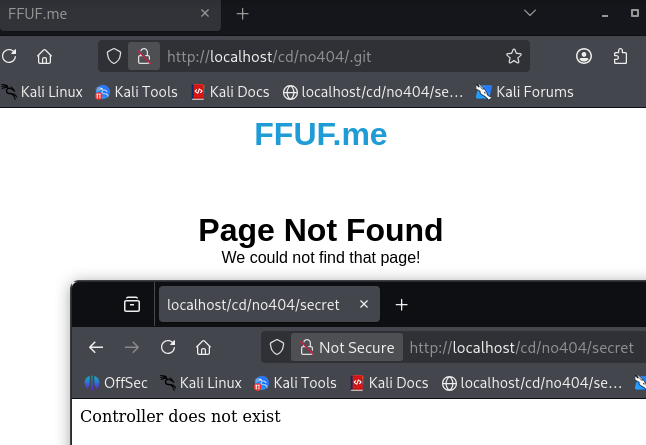

### g) Param Mining

Tässä ``ffufme``-harjoituksessa tarkoituksena oli etsiä puuttuva HTTP-parametri. Tehtävänannon mukaan osoite ``/cd/param/data`` palauttaa viestin ``Required Parameter Missing`` ja HTTP-statuksen ``400 Bad Request``. Pyyntö on siis virheellinen, koska siitä puuttuu vaadittu parametri.

Ajoin ohjeen mukaisen komennon ``$ ffuf -w ~/wordlists/parameters.txt -u http://localhost/cd/param/data?FUZZ=1``, jossa ``FUZZ `` sijoitettiin parametrin nimen paikalle osoitteessa ``http://localhost/cd/param/data?FUZZ=1``. Näin ``ffuf`` testasi ``parameters.txt``-sanalistan sanoja parametrien niminä. Vastaus palautti yhden rivin:

    debug                   [Status: 200, Size: 24, Words: 3, Lines: 1, Duration: 6ms]

Tuloksena löytyi ``debug``, joka palautti HTTP-statuksen 200. ``Debug`` oli siis tehtävässä etsitty puuttuva parametri. Varmistin tämän vielä avaamalla selaimessa osoitteen ``http://localhost/cd/param/data?debug=1``. Sain vastauksen ``Required Parameter Found``, tehtävä suoritettu.

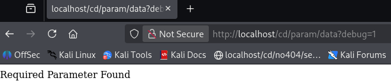

### h) Rate Limited

Kuudennessa ``ffufme``-harjoituksessa käsiteltiin palvelun rajoittamaa pyyntömäärää eli rate limiting -tilannetta. Tehtävänannon mukaan kohde sallii vain tietyn määrän pyyntöjä sekunnissa. Jos pyyntöjä lähetetään liian nopeasti, palvelin alkaa palauttaa HTTP-statusta ``429``, joka tarkoittaa liian montaa pyyntöä.

Aloitin tehtävän ajamalla ensimmäisen komennon ``$ ffuf -w ~/wordlists/common.txt -u http://ffuf.test/cd/rate/FUZZ -mc 200,429``. Dokumentaation mukaan ``-mc`` tarkoittaa Match Codea, eli sillä rajataan näkyviin vain tietyt HTTP-statuskoodit. Tässä komennossa ``-mc 200,429`` tarkoitti, että ``ffuf`` näyttää vain onnistuneet vastaukset (``200``) ja rate limit -tilanteesta kertovat vastaukset (``429``).

Ensimmäisen suorituksen vastaus ei toiminut toivotulla tavalla: 4686 pyyntöä ja 4686 virhettä.

    :: Progress: [4686/4686] :: Job [1/1] :: 0 req/sec :: Duration: [0:00:00] :: Errors: 4686 ::

Ajoin vertailun vuoksi tehtävän toisen komennon ``$ ffuf -w ~/wordlists/common.txt -t 5 -p 0.1 -u http://ffuf.test/cd/rate/FUZZ -mc 200,429``. Dokumentaation mukaan ``-t`` määrittää samanaikaisten säikeiden määrän, eli käytännössä kuinka monta pyyntöä työkalu voi tehdä rinnakkain. Tässä ``-t 5`` rajoitti rinnakkaisen työn viiteen. Optio ``-p 0.1`` lisäsi 0,1 sekunnin tauon pyyntöjen väliin. Näillä asetuksilla pyyntöjä lähetettiin rauhallisemmin, jotta palvelimen pyyntörajoitus ei ylittyisi.

Tämänkin suorituksen vastaus ei toiminut toivotulla tavalla: sama määrä pyyntöjä ja virheitä, vain pari minuuttia hitaammin.

    :: Progress: [4686/4686] :: Job [1/1] :: 47 req/sec :: Duration: [0:01:38] :: Errors: 4686 ::

Palasin lukemaan tehtävänantoa ja huomasin virheeni. Tehtävän komennot käyttivät osoitteena ``http://ffuf.test/cd/rate/FUZZ`` eivätkä ``localhostia``. Koska ulkomaailmaan ei ole asiaa, ei antamani komennot voineetkaan toimia.

Ajoin ensimmäisen komennon uudestaan, tällä kertaa oikealla osoitteella ``$ ffuf -w ~/wordlists/common.txt -u http://localhost/cd/rate/FUZZ -mc 200,429``. Sain vastaukseksi pitkän listan ``HTTP-status 429``-pyyntöjä. Virheitä komennosta löytyi tällä kertaa pyöreä nolla, komento siis toimi.

    .well-known/matrix      [Status: 429, Size: 178, Words: 8, Lines: 8, Duration: 3ms]
    .well-known/mercure     [Status: 429, Size: 178, Words: 8, Lines: 8, Duration: 10ms]
    .well-known/resourcesync [Status: 429, Size: 178, Words: 8, Lines: 8, Duration: 6ms]
    .well-known/openpgpkey  [Status: 429, Size: 178, Words: 8, Lines: 8, Duration: 14ms]
    0                       [Status: 429, Size: 178, Words: 8, Lines: 8, Duration: 2ms]
    .well-known/openid-configuration [Status: 429, Size: 178, Words: 8, Lines: 8, Duration: 15ms]
    .well-known/openorg     [Status: 429, Size: 178, Words: 8, Lines: 8, Duration: 14ms]
    .well-known/oauth-authorization-server [Status: 429, Size: 178, Words: 8, Lines: 8, Duration: 16ms]
    + noin 4670 riviä lisää
    :: Progress: [4686/4686] :: Job [1/1] :: 0 req/sec :: Duration: [0:00:00] :: Errors: 0 ::

Ajoin seuraavaksi toisen, hidastetun komennon uudestaan oikealla osoitteella ``$ ffuf -w ~/wordlists/common.txt -t 5 -p 0.1 -u http://ffuf.test/cd/rate/FUZZ -mc 200,429``. Vastaus palautti yhden rivin ilman virheitä:

    oracle                  [Status: 200, Size: 19, Words: 4, Lines: 1, Duration: 2ms]
    :: Progress: [4686/4686] :: Job [1/1] :: 47 req/sec :: Duration: [0:01:39] :: Errors: 0 ::

Hidastetun ajon jälkeen tulokseksi löytyi ``oracle``, joka palautti HTTP-statuksen ``200``. Tämä tarkoitti, että palvelin hyväksyi pyynnön ja tiedosto löytyi. Lopussa näkyi myös Errors: 0, eli ajo onnistui ilman virheitä. Verrattuna aiempaan ajoon, jossa tuli paljon 429-vastauksia, hidastaminen auttoi pysymään palvelimen pyyntörajoituksen sisällä.

Tarkistin löytämäni ``oracle``-tiedoston selaimessa osoitteessa ``http://localhost/cd/rate/oracle`` ja sain vastaukseksi tehtävän onnistuneen.

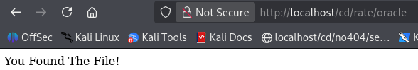

### i) Subdomains - Virtual Host Enumeration

Viimeisessä ``ffufme``-harjoituksessa tehtävänä oli etsiä alidomainia virtual host -tekniikan avulla. Harjoituksen mukaan ``ffuf``-työkalua voidaan käyttää alidomainien löytämiseen muuttamalla HTTP-pyynnön Host-otsaketta.

Ajoin ensin tehtävässä esitetyn komennon ``$ ffuf -w ~/wordlists/subdomains.txt -H "Host: FUZZ.ffuf.me" -u http://localhost``. Dokumentaation perusteella tässä ``-w ~/wordlists/subdomains.txt`` määrittää käytettävän alidomainisanalistan. Optio ``-H "Host: FUZZ.ffuf.me"`` lisää pyyntöön Host-otsakkeen, jossa ``FUZZ`` korvataan sanalistasta tulevilla sanoilla. Kohdeosoitteena käytetään paikallista palvelua ``http://localhost``. Vastaukseksi tuli pitkä lista mahdollisista alidomaineista:

    19                      [Status: 200, Size: 1495, Words: 230, Lines: 40, Duration: 11ms]
    13                      [Status: 200, Size: 1495, Words: 230, Lines: 40, Duration: 14ms]
    15                      [Status: 200, Size: 1495, Words: 230, Lines: 40, Duration: 12ms]
    14                      [Status: 200, Size: 1495, Words: 230, Lines: 40, Duration: 15ms]
    03                      [Status: 200, Size: 1495, Words: 230, Lines: 40, Duration: 13ms]
    3                       [Status: 200, Size: 1495, Words: 230, Lines: 40, Duration: 13ms]
    20                      [Status: 200, Size: 1495, Words: 230, Lines: 40, Duration: 13ms]
    + vajaa 1900 riviä lisää

Koska sama vastauskoko, sanamäärä ja rivimäärä toistuivat miltein jokaisella eri alidomainilla, pystyi nämä luokittelemaan "roskaksi". Kuten tehtävänantokin neuvoi, seuraavaksi kannatti suodattaa pois kaikki ``1495``-tavun vastaukset pois. Ajoin uuden komennon ``$ ffuf -w ~/wordlists/subdomains.txt -H "Host: FUZZ.ffuf.me" -u http://localhost -fs 1495``, mikä palautti yhden rivin:

    redhat                  [Status: 200, Size: 15, Words: 2, Lines: 1, Duration: 6ms]

Tämä osoitti, että ``redhat`` oli tehtävänannossa etsitty virtual host -alidomaini. Koska ``FUZZ`` oli sijoitettu Host-otsakkeeseen muodossa ``FUZZ``.ffuf.me, löydetty alidomaini oli ``redhat.ffuf.me``. Tarkistin tämän vielä komennolla ``curl -H "Host: redhat.ffuf.me" http://localhost`` ja sain vastaukseksi ``Subdomain Found``.

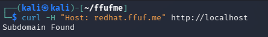

## Lähteet

Tero Karvinen
- Find Hidden Web Directories - Fuzz URLs with ffuf, 2023: https://terokarvinen.com/2023/fuzz-urls-find-hidden-directories/
- Fuffme - Install Web Fuzzing Target on Debian, 2023: https://terokarvinen.com/2023/fuffme-web-fuzzing-target-debian/

Joona Hoikkala, GitHub
- Ffuf, README.md: https://github.com/ffuf/ffuf/blob/master/README.md

Linux man-pages
- chmod: https://man7.org/linux/man-pages/man1/chmod.1.html

Daniel Miessler, Github
- SecLists: https://github.com/danielmiessler/seclists

Docker
- Docker Image Build: https://docs.docker.com/reference/cli/docker/image/build/
- Docker Container Run: https://docs.docker.com/reference/cli/docker/container/run/