# h7 Toukokuu2026!

Viikon läksyjen tarkemmat tehtävänannot löytyvät kurssin [sivuilta](https://terokarvinen.com/tunkeutumistestaus/#h7-toukokuu2026).

### Kurssilla käytetty työympäristö
- Lenovo Yoga Slim 7 Pro (AMD Ryzen 7 5800H @ 3.20 GHz, 16 GB DDR4-3200, NVIDIA GeForce RTX 3050 laptop 4 GB GDDR6). WIN11, versio 25H2.
- Oracle VirtualBox 7.2.8
  - Linux Kali 2026.1 x64, 4 GB RAM, 2 prosessoria
  - Metasploitable 2, 2 GB RAM
- Molemmat virtuaalikoneet ovat host-only verkossa.
  - VirtualBox Host-Only Ethernet Adapter #2.
    - Adapteri konfiguroitu manuaalisesti, DHCP Server käytössä.

<!-- Labratehtävissä virtuaalikoneet eivät ole julkisessa verkossa. Tämä on varmistettu pingaamalla kummallakin koneella ``$ ping 8.8.8.8`` ja vastaukseksi on saatu ``ping: connect: Network is unreachable``.

Tehtävissä käytetty Linux Kalia, ellei toisin mainita. Metasploitable on ollut taustalla auki. -->

## x) Lue ja tiivistä

> Lue ja tiivistä:
> 1. Karvinen 2022: [Cracking Passwords with Hastcat](https://terokarvinen.com/2022/cracking-passwords-with-hashcat/).
> 2. Karvinen 2023: [Crack File Password With John](https://terokarvinen.com/2023/crack-file-password-with-john/).

#### Karvinen 2022: Cracking Passwords with Hashcat

- Järjestelmät eivät yleensä tallenna salasanoja sellaisenaan, vaan niistä tehtyjä tiivisteitä eli hasheja. Hashia ei voi suoraan palauttaa takaisin alkuperäiseksi salasanaksi.
- Hashcat toimii kokeilemalla eri salasanoja esimerkiksi sanakirjasta ja vertaamalla niiden hasheja annettuun hash-arvoon.
- RockYou-sanastossa on yli 14 miljoonaa yleistä tai vuotanutta salasanaa.
- Tarvittavia työkaluja:
  - ``hashcat``: varsinainen salasananmurto-ohjelma, jolla hasheja yritetään murtaa.
  - ``hashid``: työkalu, jolla arvioidaan, mitä tyyppiä annettu hash voisi olla.
  - ``wget``: komentorivityökalu, jolla voidaan ladata tiedostoja verkosta, kuten sanalistoja.

*Artikkeli muistuttaa, että käyttäjälle mukava salasana voi olla hyökkääjälle vielä mukavampi. Helppo muistaa on usein myös helppo murtaa — etenkin jos salasana sattuu löytymään sanakirjasta.*

#### Karvinen 2023: Crack File Password With John

- John the Ripperin Jumbo-versio tukee valtavaa määrää formaatteja: iTunesista Telegramiin, Officeen, PDF:iin, KeePassiin, ZIP:iin ja RAR:iin. Eri tiedostotyypeille on omia *2john-työkaluja, jotka poimivat tiedostosta Johnille sopivan hashin.
- Asennus vaatii pienen terminaalijumppan: riippuvuudet kuntoon, John GitHubista koneelle ja lopuksi ohjelman kääntäminen.
- Salasanalla suojatusta tiedostosta täytyy ensin muodostaa Johnille sopiva hash, esimerkiksi ZIP-tiedoston kohdalla zip2john-työkalulla.
  - Varsinainen murtaminen tehdään John the Ripperillä ja sanakirjalla, eli ohjelma kokeilee sanalistasta löytyviä salasanoja.

*John the Ripperin Jumbo-versio on formaattituen puolesta melkoinen Sveitsin armeijan linkkuveitsi. Erinomainen muistutus samalla siitä miksi omien salasanojen kannattaa olla muutakin kuin perhosia ja kesäpäiviä.*

## a) Hashcat

> Asenna Hashcat ja testaa sen toiminta murtamalla esimerkkisalasana.

Osa tehtävän työkaluista löytyi Kalista jo valmiina. Kuvittelin kuitenkin aloittavani tehtävän puhtaalta pöydältä, joten ajoin asennukset komennoilla:

    $ sudo apt-get update
    $ sudo apt-get -y install hashid hashcat wget     // asentaa työkalut: hashid, hashcat ja wget

Seuraavaksi loin uuden kansion harjoitusta varten ja siirryin tähän hakemistoon:

    $ mkdir hashprac1
    $ cd hashprac1

Latasin ja purin tähän kansioon Daniel Miesslerin ja kumppaneiden kokoaman Rockyou-sanakirjan:

    $ wget https://github.com/danielmiessler/SecLists/raw/master/Passwords/Leaked-Databases/rockyou.txt.tar.gz
    $ tar xf rockyou.txt.tar.gz
    $ rm rockyou.txt.tar.gz             // poistin turhaksi jääneen pakatun tar.gz-tiedoston

Rockyou-sanakirja todellakin piti sisällään reilun 14 miljoonaa mahdollisuutta:

    $ wc -l rockyou.txt

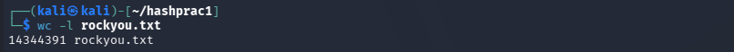

Käytin esimerkkinä Karvisen Cracking Passwords with Hashcat -artikkelissakin käytettyä mallitiivistettä: ``6b1628b016dff46e6fa35684be6acc96``. Ensimmäisenä tämä tuli selvittää tiivisteen tyyppi. Hashcatin [dokumentaatiosta](https://hashcat.net/wiki/doku.php?id=example_hashes) löytyi jokunen eri tyyppi, eli algoritmi tai formaatti jolla hash on muodostettu. (Hashcat wiki, Example hashes)

Tiivisteen tyypin (ja tyyppinumeron -m) sai selvitettyä komennolla:

    hashid -m 6b1628b016dff46e6fa35684be6acc96

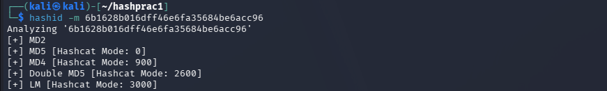

Esimerkki vastausrivistä ``[+] MD5 [Hashcat Mode: 0]``:
- ``[+]`` mahdollinen osuma tyypille
- ``MD5`` hashin mahdollinen tyyppi
- ``[Hashcat Mode: 0]`` -m optiolla löydetty tyyppinumero

Karvinen kokeili artikkelissaan murtaa hashin MD5-tyypillä, sillä se on yleisempi verrattuna MD2- tai MD4-tyyppeihin. Artikkelissa hän myös mainitsee oikean tyypin yleisesti olevan kolmen ylimmän kandidaatin joukossa. Lähdin itse kokeilemaan murtaa hashia MD4-tyypillä:

    $ hashcat -m 900 '6b1628b016dff46e6fa35684be6acc96' rockyou.txt -o solved

- ``hashcat`` käynnistää ohjelman.
- ``-m 900`` määrittää hashtyypiksi MD4.
- ``'6b16...98'`` on murrettava hash.
- ``rockyou.txt`` määrittää käytettävän sanakirjan.
- ``-o solved`` tallentaa tuloksen tiedostoon solved.

Komento käynnisti Hashcatin MD4-modella yrittäen murtaa hashin rockyou.txt -sanakirjan avulla.

Vastauksen perusteella ensimmäinen yritys oli ohilaukaus:

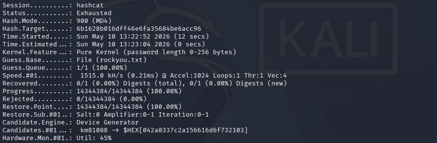

    Status...........: Exhausted
    Recovered........: 0/1 (0.00%)
    Progress.........: 14344384/14344384 (100.00%)

Hashcat kävi koko rockyou.txt-sanakirjan 14.3 miljoonaa salasanaa läpi löytämättä oikeaa, ja lopputuloksena oli varsin uupunut ``Exhausted``.

Palasin takaisin pari kohtaa taakse päin ja yritin murtaa salasanan esimerkin mukaisesti MD5-tyypillä:

    $ hashcat -m 0 '6b1628b016dff46e6fa35684be6acc96' rockyou.txt -o solved

Vastaus tuli hyvin nopeasti:

    Status...........: Cracked
    Recovered........: 1/1 (100.00%)
    Progress.........: 2048/14344384 (0.01%)

Tällä kertaa lopputuloksena oli ``Cracked``, salasana murtui ilman hikeä jo reilun 2000 yrityksen jälkeen.

Murretusta tiivisteestä saatu salasana oli nyt solved-tiedostossa. Tämän pystyi lukemaan komennolla:

    $ cat solved

Kesää kohti, salasana oli: summer

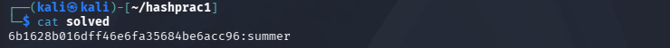

## c) John the Ripper

> Asenna John the Ripper ja testaa sen toiminta murtamalla jonkin esimerkkitiedoston salasana.

John löytyi Kalista valmiiksi asennettuna, eikä ihan karvalakkimallina:

    $ john --list=formats

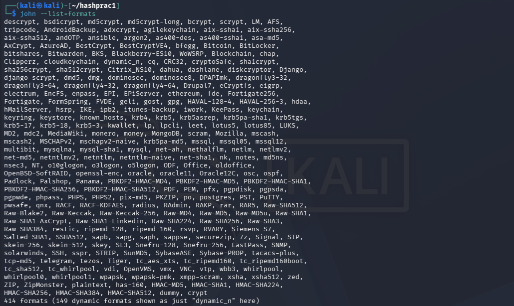

    414 formats (149 dynamic formats shown as just "dynamic_n" here)

Aloitin tehtävän luomalla uuden harjoituskansion ja siirtymällä tähän hakemistoon:

    $ mkdir johnprac1
    $ cd johnprac1

Latasin esimerkkitiedoston Karvisen artikkelista Crack File Password With John:

    $ wget https://TeroKarvinen.com/2023/crack-file-password-with-john/tero.zip

Ladattu tiedosto oli suojattu salasanalla ja kun salasana oli mysteeri, purkaminen oli verrattain hankalaa:

    $ unzip tero.zip

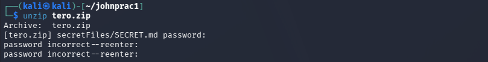

Karvisen artikkelin mukaan ZIP-salasanan murtaminen on kaksivaiheinen prosessi: ensin ZIP-tiedostosta poimitaan hash uuteen tiedostoon zip2john-työkalulla, ja vasta sen jälkeen John the Ripper tekee sanakirjahyökkäyksen tätä hashia vastaan. (Karvinen 2023: Crack File Password With John)

Hashin poimiminen uuteen tiedostoon ZIP-tiedostosta onnistui komennolla:

    $ zip2john tero.zip >tero.zip.hash

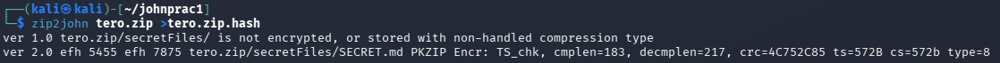

Vastauksen perusteella kansio ei nähtävästi ole suojattu, vaan sen sisältä löytyvä SECRET.md -tiedosto on.

Tarkistin ennen seuraavaa vaihtetta miltä saatu hash näytti komennolla:

    $ cat tero.zip.hash

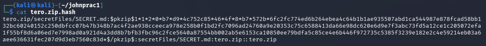

``tero.zip/secretFiles/SECRET.md:`` hash poimittiin tosiaan SECRET.md -tiedostolle. Nyt oli aika antaa Johnin murtaa hash:

    $ john tero.zip.hash

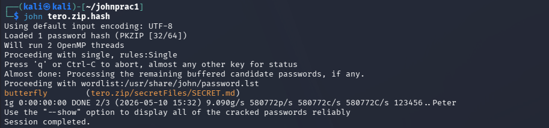

Vastauksen keskeinen rivi toi kesän ja kärpästen lisäksi perhosia, salasana oli butterfly:

    butterfly        (tero.zip/secretFiles/SECRET.md)

Nyt kun salasana oli selvitetty, jäljellä oli enää aiemmin ladatun ZIP-tiedoston avaaminen. Purkaminen tapahtui taas komennolla:

    $ unzip tero.zip

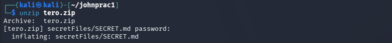

Purkaminen onnistui, ja puretun kansion sisältä löytyi keskiössä ollut tiedosto ``SECRET.md``. Tehtävän onnistuminen kävi ilmi lukemalla tiedoston sisältö komennolla:

    $ cat secretFiles/SECRET.md

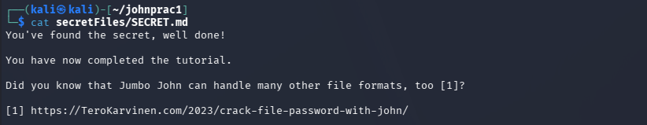

## e) Tiedosto

> Tee itse tai etsi verkosta jokin salakirjoitettu tiedosto, jonka saat auki. Murra sen salaus. (Jokin muu formaatti kuin aiemmissa alakohdissa kokeilemasi).

Ensimmäinen ymmärrettävä formaatti, joka osui silmään oli Office. Kalista ei löytynyt LibreOfficea valmiina, joten ennen avaamista tuli se asentaa:

    $ sudo apt-get -y install LibreOffice
    $ libreoffice

Loin salasanalla suojatun ``nothing-important.docx``-tekstitiedoston uuteen johnprac2 -kansioon. Tiedoston salasana oli ``qwerty123``.

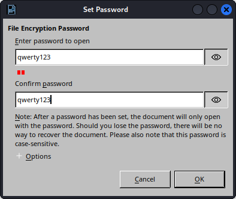

Siirryin hakemistoon, johon tallensin tiedoston, ja kurkistin miltä tallentamani tiedosto näytti:

    $ cd ~/johnprac2
    $ cat nothing-important.docx

Vastaus oli kaikkea muuta kuin selvää pässinlihaa.

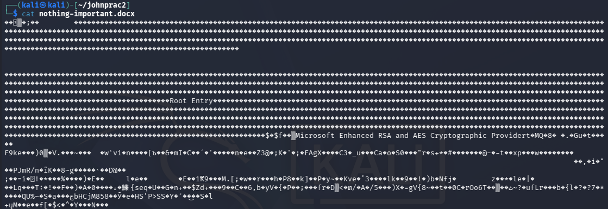

Tehtävä mukaili pitkälti edellistä: poimi ensin tiiviste Johnille työstettäväksi. Ensimmäinen vaihe onnistui komennolla:

    $ office2john nothing-important.docx >nothing-important.docx.hash

Toisessa vaiheessa John päästettiin irti komennolla:

    $ john nothing-important.docx-hash

Luulin valinneeni melko yleisen salasanan, mutta John ei ollut löytänyt tätä 10 minuutin aikana. Tapoin haun CTRL+C -näppäin komennolla. Huomasin komennon alussa, että John käytti omaa sanakirjaa ``/usr/share/john/password.lst``.

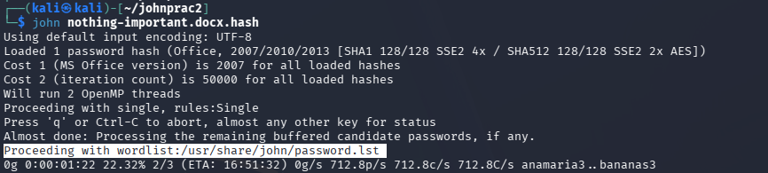

Johnin --help-ohjeistuksesta löytyi optio:

    --list=WHAT                List capabilities, see --list=help or doc/OPTIONS

Ajoin Johnin komennon uudelleen käyttäen löytämääni optiota:

    $ john --wordlist=/home/kali/hashprac1/rockyou.txt nothing-important.docx.hash

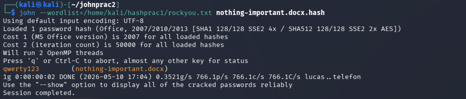

Vastaus löytyi tällä kertaa sekunneissa:

    qwerty123        (nothing-important.docx)

Avasin salasanalla suojatun .docx-tiedoston ja syötin "löytämäni" salasanan:

    $ libreoffice nothing-important.docx

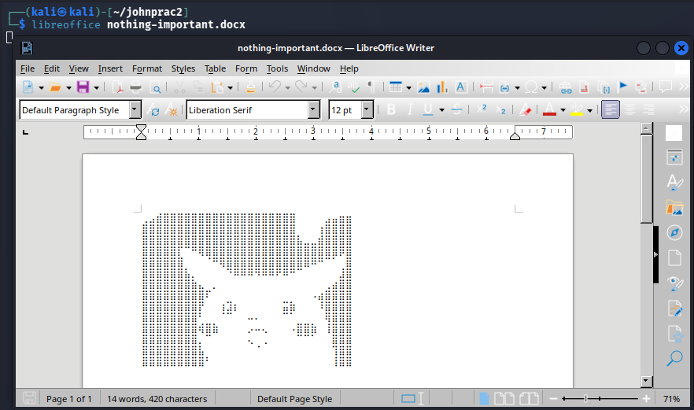

## f) Tiiviste

> Tee itse tai etsi verkosta salasanan tiiviste, jonka saat auki. Murra sen salaus. (Jokin muu formaatti kuin aiemmissa alakohdissa kokeilemasi.)

Aloitin tehtävän luomalla Kaliin uuden käyttäjän, varjo_veijarin ja annoin hänelle salasanaksi 1q2w3e:

    $ sudo adduser varjo_veijari

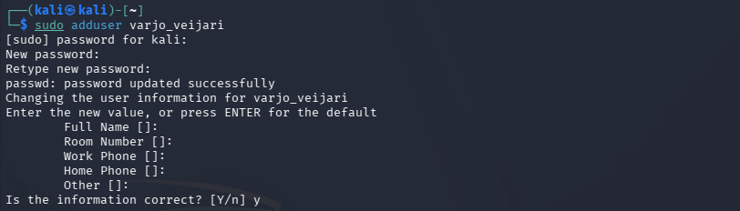

    $ mkdir hashprac2
    $ cd hashprac2

Tiesin entuudestaan, että Linuxin salasanatiivisteet tallentuvat /etc/shadow-tiedostoon. Tämän avulla löysin Kalin John-dokumentaatiosta oikean työkalun, unshadow, jolla /etc/passwd- ja /etc/shadow-tiedostojen tiedot voidaan yhdistää Johnille sopivaan muotoon. (Kali, John unshadow)

Komento jota kokeilin oli seuraava:

    $ unshadow /etc/passwd /etc/shadow >hashprac2.txt

Jonka vastauksena oli ``permission denied``. Uusi yritys sudo voimin:

    $ sudo unshadow /etc/passwd /etc/shadow >hashprac2.txt

Sudovoimien avulla hashprac2.txt -tekstitiedoston luominen onnistui. Tiedosto näkyi ``ls``-komennolla hakemiston tiedostoissa.

Tarkistin uudelleen, mitä kaikkea Johnin --help-ohjeista löytyikään. Seuraava rivi vaikutti erittäin hyvältä lisältä tehtävää varten:

    --users=[-]LOGIN|UID[,..]  [Do not] load this (these) user(s) only

Kokeilin yhdistää seuraavaan Johnille määrättyyn tehtävään rockyou.txt -sanakirjan, sekä vain varjo_veijarin salasanan kaivamisen. Komento jonka annoin oli:

    $ john --wordlist=/home/kali/hashprac1/rockyou.txt --users=varjo_veijari hashprac2.txt

Komento ei kuitenkaan toiminut ja sain vastaukseksi:

    Using default input encoding: UTF-8
    No password hashes loaded (see FAQ)

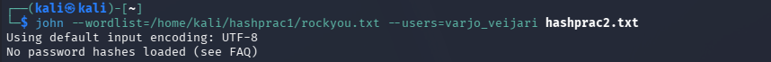

Tarkistin mitä hashprac2.txt piti sisällään komennolla:

    $ cat hashprac2.txt

Sieltä löytyi kyllä rivi: ``varjo_veijari:$y$j9T$Wxa0...``

Löysin [keskustelun](https://superuser.com/questions/1684358/john-the-ripper-on-kali-linux-it-outputs-no-password-hashes-loaded), jonka mukaan syy on hashin alussa löytyvästä ``$y$``-pätkästä. Tämä tarkoitti, että salasana on tallennettu Yescrypt-muotoon. Keskustelusta kävi myös ilmi, että John ei ymmärrä tätä ilman pientä apua, joten uusi komento oli vinkkien jälkeen:

    $ john --format=crypt --wordlist=/home/kali/hashprac1/rockyou.txt --users=varjo_veijari hashprac2.txt

Kannatti kaivaa Googlea, komento toimi ja varjo_veijarin salasana paljastui:

    1q2w3e           (varjo_veijari) 

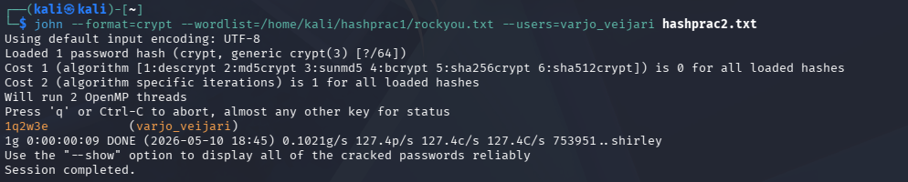

## g) Sanakirja

> Oman sanakirjan teko parantaa onnistumismahdollisuuksia. Demonstroi, kuinka teet oman sanakirjan hashcat:n tai john:iin.

Tehtävänannon vinkeistä löytyi cewl, josta lähdin etsimään tietoa. CeWL eli Custom Word List generator on Rubylla tehty työkalu, joka käy annetun verkkosivun läpi määritettyyn syvyyteen asti ja kerää sivulta uniikkeja sanoja sanakirjalistaksi. (Robin Wood, Digininja Github)

Sanakirjan lähteeksi päätyi random Wikipedia artikkeli: https://fi.wikipedia.org/wiki/Tatra_T6A5 :train:hei olen ratikka

Komennoksi valikoitui seuraava:

    cewl -v -d 1 -m 4 -w sanakirjatatra.txt https://fi.wikipedia.org/wiki/Tatra_T6A5

- ``-v``, verbose näyttää tarkemmin, mitä komento tekee.
- ``-d 1`` rajaa kuinka pitkälle oletussivulta eri linkkejä edetään.
  - oletuksena 2 linkkiä eteenpäin.
  - Wikipediassa on linkkejä joita seurata, joten rajaus yhden linkin päähän on varsin kohtuullinen.
- ``-m 4`` määrittää minimimerkkien määrän, joita sanakirjaan poimitaan.
- ``-w sanakirjatatra.txt`` tallentaa sanakirjan annetulla nimellä.
- ``https://fi.wikipedia.org/wiki/Tatra_T6A5`` viimeisenä annettiin sivu, josta sanoja poimittiin.

Komento pyöri aikansa, kunnes kaikki sanat olivat saatu koottua sanakirjaan. Tarkistin, kuinka monta sanaa sanakirjasta löytyi komennolla:

    $ wc -l sanakirjatatra.txt

Sanoja oli kertynyt muutama: ``7598``

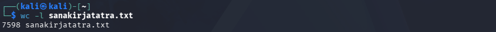

Kurkkasin vielä nopeasti, mitä sanoja sanakirjasta löytyy, ja tulos oli varsin monipuolinen:

    cat sanakirjatatra.txt

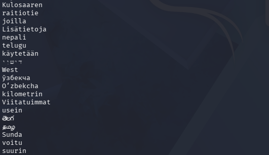

## h) Hash rules!

> Näytä esimerkki HashCatin sääntöjen käytöstä (rules).

Loin ensiksi yksinkertaisen rulemalli.txt -tekstitiedoston, josta löytyi vain sana password:

    $ echo password > rulemalli.txt

Löysin hashcatin [dokumentaatiosta](https://hashcat.net/wiki/doku.php?id=rule_based_attack) funktiot eri säännöille, ja näiden perusteella loin nanolla uuden sääntötiedoston:

    $ nano oma.rule

| Sääntö   | Merkitys                          | 
| -------- | --------------------------------- | 
| `:`      | ei muutosta                       | 
| `u`      | kaikki kirjaimet isoiksi          | 
| `c`      | ensimmäinen isoksi, muut pieniksi | 
| `$1`     | lisää loppuun `1`                 | 
| `$!`     | lisää loppuun `!`                 | 
| `$1$2$3` | lisää loppuun `123`               | 
| `^!`     | lisää alkuun `!`                  | 
| `sao`    | korvaa kaikki `a`-merkit `o`:lla  | 

(Hashcat Wiki, Rule Based Attack)

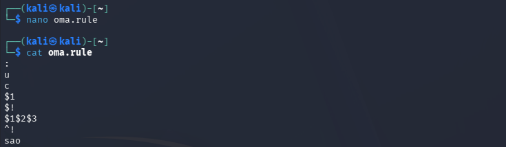

Hashcatin dokumentaatiosta selvisi myös, miten hashcatilla voi debugata sääntöjä ilman hasheja. Tämä onnistui käyttämällä ``--stdout``-optiota, mikä tulostaa generoidut salasanat sen sijaan, että se yrittäisi murtaa mitään. Tämä onnistui komennolla:

    $ hashcat --stdout -r oma.rule rulemalli.txt

Vastauksena tuli lista uusia salasanoja:

    password
    PASSWORD
    Password
    password1
    password!
    password123
    !password
    possword

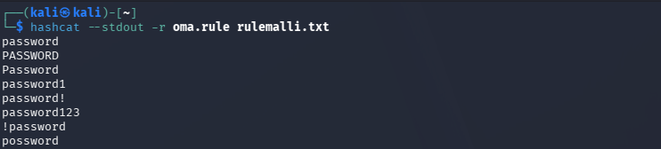

Tulosteesta näki, että sääntötiedosto toimi odotetusti. Jokainen sääntö muokkasi alkuperäistä sanaa `password` säännössä asetetuin tavoin.

## i) Lippuvalmistelu

> Valmistele kone ensi viikon lipunryöstöön. Tästä kohdasta ei tarvita kattavaa raporttia, riittää pelkkä luettelo siitä, miten ratkaisit allaolevat kysymykset.  Jos sinulla on esimerkiksi valmis, toimiva Kali VM tavallisella PC:llä, tässä ei tarvitse tehdä juuri mitään.

Käytössäni on kurssilla käyttämä Kali Linux -virtuaalikone.

Ympäristö:
- Lenovo Yoga Slim 7 Pro
  - AMD Ryzen 7 5800H @ 3.20 GHz
  - 16 GB DDR4-3200
  - NVIDIA GeForce RTX 3050 Laptop GPU, 4 GB GDDR6
  - Windows 11, versio 25H2
- Oracle VirtualBox 7.2.8
  - Kali Linux 2026.1 x64, 4 GB RAM, 2 prosessoria

Kalissa on käytössä sekä NAT- että host-only-adapteri.

## Lähteet

Tero Karvinen
- Tunkeutumistestaus, h7 toukokuu2026: https://terokarvinen.com/tunkeutumistestaus/#h7-toukokuu2026
- Cracking Passwords with Hashcat: https://terokarvinen.com/2022/cracking-passwords-with-hashcat/
- Crack File Password with John: https://terokarvinen.com/2023/crack-file-password-with-john/

Hashcat Wiki
- Example hashes: https://hashcat.net/wiki/doku.php?id=example_hashes
- Rule Based Attack: https://hashcat.net/wiki/doku.php?id=rule_based_attack

Kali.org Tools
- John, unshadow: https://www.kali.org/tools/john/#unshadow

SuperUser Questions
- john the ripper, on kali linux it outputs no password hashes loaded: https://superuser.com/questions/1684358/john-the-ripper-on-kali-linux-it-outputs-no-password-hashes-loaded

Robin Wood, Digininja Github
- CeWL: https://github.com/digininja/CeWL

